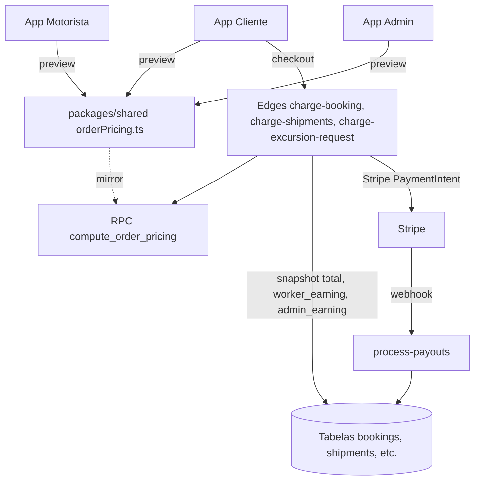

## Contexto

**Fórmula canônica (gross-up literal do PDF):**

```
denom = 1 − gain_pct − discount_pct − admin_pct   (em decimal)
Total = (base + adicionais_em_reais) / denom
promo_gain     = Total × gain_pct
promo_discount = Total × discount_pct
admin_fee      = Total × admin_pct
Motorista      = base + promo_gain − promo_discount
Admin          = admin_fee + adicionais
```

Para **preparador de encomendas/excursão**: `admin_pct = 0`. O `ganho_promo` soma ao preparador. Adicionais vão pro preparador (PDF: "admin não participa").

Para **excursão (produto final)**: backoffice define manualmente em `excursion_requests.budget_lines` — sem fórmula automática.

**Decisões validadas com o usuário:**
- Interpretação A (gross-up literal).
- Promoção atrelada a `worker_route` / `pricing_route`.
- Incluir preparador de encomendas no escopo (DB/edge/admin, sem tocar no app dedicado).
- Implementar excursão conforme PDF (backoffice manual + catálogo reutilizável).

---

## Gaps auditados (resumo)

- **DB**: `promotions` não tem vínculo com rota; falta `discount_pct_to_passenger` separado de `gain_pct_to_worker`; `surcharge_catalog` não tem `surcharge_type` (viagem/encomenda/preparador*); snapshots dos pedidos não gravam `worker_earning_cents` / `admin_earning_cents`.
- **RPC**: `compute_platform_fee_cents` aplica `base × admin%` (subtotal), não gross-up. `apply_active_promotion` usa fórmula híbrida `GREATEST(0, admin% − gain%)` divergente do PDF.
- **Edges**: `charge-booking` faz split no PaymentIntent mas com fórmula errada. `charge-shipments` vai 100% pra plataforma (sem split). `charge-excursion-request` idem (comentário explícito no código).
- **Admin** (`apps/admin/src/screens/PromocaoCreateScreen.tsx`): checkboxes de cidades não salvam no payload; bug em `PagamentosGestaoScreen` lendo `pricing_routes.price_per_person_cents` (coluna real é `price_cents`); formato híbrido de `platform_settings` (`{percentage}` vs `{value}`).
- **Cliente**: `shipmentQuote.ts` aplica `subtotal × admin%` (não gross-up); `SelectDependentTripDriverScreen.tsx` tem fallback R$50 hardcoded; `PACKAGE_SIZE_MULT` (1/1.12/1.28) hardcoded sem origem em DB.
- **Motorista** (`apps/motorista/src/screens/RouteScheduleScreen.tsx`): `totalValue` só aplica weekend; noturno/feriado salvos mas não usados; campos iniciam em `15/15/15` sem carregar da BD. `HomeEncomendasScreen.tsx` tem fallback "+15%" estático. Excursão não multiplica `diária × dias`.
- **Payouts**: `process-payouts` referencia tabelas `payout_logs` e `payouts.receipt_url` ausentes nas migrations. `manage-promotions/index (1).ts` tem nome quebrado.

---

## Arquitetura alvo



---

## Fase 0 — Fundamentos de dados (migrations)

Novo migration único `supabase/migrations/20260501120000_pricing_alignment.sql`:

- `promotions`: adicionar `worker_route_id uuid` (FK `worker_routes`), `pricing_route_id uuid` (FK `pricing_routes`), `origin_city text`, `discount_pct_to_passenger numeric(5,2) NOT NULL DEFAULT 0`. Manter `gain_pct_to_worker`. Backfill: onde `discount_type='percentage'`, copiar `discount_value` → `discount_pct_to_passenger`.
- `surcharge_catalog`: adicionar `surcharge_type text NOT NULL DEFAULT 'viagem'` com CHECK em `('viagem','encomenda','preparador_encomendas','preparador_excursoes')`. Permitir múltiplos adicionais por tipo.
- `bookings`, `shipments`, `dependent_shipments`, `excursion_requests`: adicionar `promo_gain_cents int DEFAULT 0`, `promo_discount_cents int DEFAULT 0`, `worker_earning_cents int`, `admin_earning_cents int`, `promotion_route_id uuid`. Backfill zero nos históricos.
- `payouts`: adicionar `receipt_url text` (corrige edge já em uso).
- Criar tabela `payout_logs` (ausente mas referenciada em `process-payouts`).

Fórmula canônica na DB: `supabase/migrations/20260501121000_compute_order_pricing.sql`:

```sql
CREATE OR REPLACE FUNCTION public.compute_order_pricing(
  p_base_cents int,
  p_surcharges_cents int,
  p_admin_pct numeric,
  p_gain_pct numeric DEFAULT 0,
  p_discount_pct numeric DEFAULT 0
) RETURNS jsonb AS $$
DECLARE
  v_denom numeric := 1 - (p_admin_pct + p_gain_pct + p_discount_pct) / 100.0;
  v_total int;
  v_gain int;
  v_disc int;
  v_admin int;
BEGIN
  IF v_denom <= 0.05 THEN RAISE EXCEPTION 'pricing:overflow'; END IF;
  v_total := ROUND( (p_base_cents + COALESCE(p_surcharges_cents,0)) / v_denom )::int;
  v_gain  := ROUND(v_total * p_gain_pct / 100.0)::int;
  v_disc  := ROUND(v_total * p_discount_pct / 100.0)::int;
  v_admin := ROUND(v_total * p_admin_pct / 100.0)::int;
  RETURN jsonb_build_object(
    'total_cents', v_total,
    'base_cents', p_base_cents,
    'surcharges_cents', COALESCE(p_surcharges_cents,0),
    'admin_fee_cents', v_admin,
    'promo_gain_cents', v_gain,
    'promo_discount_cents', v_disc,
    'worker_earning_cents', p_base_cents + v_gain - v_disc,
    'admin_earning_cents', v_admin + COALESCE(p_surcharges_cents,0)
  );
END; $$ LANGUAGE plpgsql IMMUTABLE;
```

Reescrever `apply_active_promotion` / `apply_active_promotion_for_amounts` pra:
- Buscar promo ativa filtrando por `worker_route_id` OU `pricing_route_id` conforme pedido.
- Retornar `{gain_pct, discount_pct, promotion_id}` (não calcular valores aqui — deixar pro `compute_order_pricing`).

---

## Fase 1 — Biblioteca compartilhada

Criar [`packages/shared/src/orderPricing.ts`](packages/shared/src/orderPricing.ts):

```ts
export type PricingInput = {
  baseCents: number;
  surchargesCents?: number;
  adminPct: number;
  gainPct?: number;
  discountPct?: number;
};
export type PricingResult = { /* todos os campos do JSONB acima */ };
export function computeOrderPricing(i: PricingInput): PricingResult { /* mesma fórmula */ }
export function formatPricingBreakdown(r: PricingResult): string[] { /* linhas p/ UI */ }
```

Exportar no `packages/shared/src/index.ts`. Substitui `bookingCardChargeAmountCents` e parte de `orderPricingSnapshot.ts` no app cliente.

---

## Fase 2 — Edges (backend)

- [`supabase/functions/charge-booking/index.ts`](supabase/functions/charge-booking/index.ts) linhas 298–353: trocar cálculo manual de `chargeAmountCents` e `platformFeeCents` por chamada ao RPC `compute_order_pricing` (admin_pct da rota, gain/discount via nova `apply_active_promotion`). Persistir 4 campos no booking. `application_fee_amount = admin_earning_cents`.
- [`supabase/functions/charge-shipments/index.ts`](supabase/functions/charge-shipments/index.ts) linhas 263–272: adicionar `transfer_data[destination]` para motorista/preparador quando `stripe_connect_charges_enabled`. Para papel preparador_encomendas, `admin_pct = 0`. Persistir snapshot completo.
- [`supabase/functions/charge-excursion-request/index.ts`](supabase/functions/charge-excursion-request/index.ts): manter 100% plataforma no charge (comentário atual), mas persistir breakdown pra `process-payouts` fazer os transfers corretos.
- [`supabase/functions/process-payouts/index.ts`](supabase/functions/process-payouts/index.ts): usar `worker_earning_cents` do snapshot (fonte única de verdade); criar `payout_logs` se faltante.
- `manage-promotions/index (1).ts`: renomear pra `manage-promotions/index.ts`, atualizar campos novos (worker_route_id, pricing_route_id, gain_pct, discount_pct_to_passenger).

---

## Fase 3 — Admin

- [`apps/admin/src/screens/PromocaoCreateScreen.tsx`](apps/admin/src/screens/PromocaoCreateScreen.tsx) linhas 115–235: remover `CITY_OPTIONS` fake; adicionar seletor de `worker_route` OU `pricing_route` (dropdown com busca); adicionar inputs separados `gain_pct_to_worker` e `discount_pct_to_passenger`; incluir no payload.
- [`apps/admin/src/screens/PagamentosGestaoScreen.tsx`](apps/admin/src/screens/PagamentosGestaoScreen.tsx) linha ~898: corrigir `price_per_person_cents` → `price_cents`. KPIs usam novo breakdown.
- Novo ecrã `apps/admin/src/screens/AdicionaisScreen.tsx` — CRUD de `surcharge_catalog` com campo `surcharge_type` (chip/segmented control por tipo), vincula a `pricing_route_surcharges`.
- [`apps/admin/src/screens/ConfiguracoesScreen.tsx`](apps/admin/src/screens/ConfiguracoesScreen.tsx): unificar `platform_settings` pra `{percentage: N}` (migrar chamadas `{value: X}` via `usePlatformSettings.ts` linhas 52–56).
- [`apps/admin/src/screens/ElaborarOrcamentoScreen.tsx`](apps/admin/src/screens/ElaborarOrcamentoScreen.tsx): adicionar importador de "pacotes" e "itens de recreação" de 2 novos catálogos (`excursion_package_catalog`, `excursion_recreation_items`), PDF § "Excursão".
- Preview de split em todas as telas de pedido usando `computeOrderPricing` shared.

---

## Fase 4 — Cliente

- [`apps/cliente/src/lib/clientScheduledTrips.ts`](apps/cliente/src/lib/clientScheduledTrips.ts) linhas 190–214: substituir `applyBookingsPromoToTripListAmounts` por RPC que retorna total final (gross-up) já com admin + promo aplicados.
- [`apps/cliente/src/lib/bookingChargePreview.ts`](apps/cliente/src/lib/bookingChargePreview.ts): deprecar; exportar `computeOrderPricing` shared.
- [`apps/cliente/src/lib/shipmentQuote.ts`](apps/cliente/src/lib/shipmentQuote.ts) linhas 367–381: remover cálculo `subtotal × admin%`; usar `computeOrderPricing` com adicionais do catálogo tipo 'encomenda'/'preparador_encomendas'. Remover `PACKAGE_SIZE_MULT` hardcoded ou migrar pra tabela `platform_settings`.
- [`apps/cliente/src/lib/orderPricingSnapshot.ts`](apps/cliente/src/lib/orderPricingSnapshot.ts): ler do novo resultado; preencher todos os campos do snapshot (inclui `worker_earning_cents`, `admin_earning_cents`).
- [`apps/cliente/src/screens/trip/CheckoutScreen.tsx`](apps/cliente/src/screens/trip/CheckoutScreen.tsx) linhas 275–348 e [`apps/cliente/src/screens/shipment/ConfirmShipmentScreen.tsx`](apps/cliente/src/screens/shipment/ConfirmShipmentScreen.tsx): exibir breakdown detalhado (Base / Adicionais / Ganho promo / Desconto promo / Taxa admin / Total).
- [`apps/cliente/src/screens/shipment/SelectDependentTripDriverScreen.tsx`](apps/cliente/src/screens/shipment/SelectDependentTripDriverScreen.tsx) linhas 29, 111–112: remover `PLACEHOLDER_AMOUNT_CENTS = 5000`; forçar erro se valor nulo.
- [`apps/cliente/src/lib/types.ts`](apps/cliente/src/lib/types.ts) linhas 58–90: completar `ShipmentStackParamList` com `SelectShipmentDriver` e pricing params.
- Excursão cliente: nada muda no cálculo (backoffice define); só exibir `budget_lines` + total.

---

## Fase 5 — Motorista

- [`apps/motorista/src/screens/RouteScheduleScreen.tsx`](apps/motorista/src/screens/RouteScheduleScreen.tsx) linhas 66–74, 82, 387–397: carregar `weekend/nocturnal/holiday_surcharge_pct` da BD ao montar; aplicar os **três** em `totalValue` (ou migrar pra adicionais do catálogo `surcharge_type='viagem'` e persistir em centavos, não %).
- [`apps/motorista/src/screens/HomeEncomendasScreen.tsx`](apps/motorista/src/screens/HomeEncomendasScreen.tsx) linha ~393: ler `gain_pct_to_worker` da promoção ativa; remover "+15%" estático.
- [`apps/motorista/src/screens/excursoes/RealizarEmbarquesScreen.tsx`](apps/motorista/src/screens/excursoes/RealizarEmbarquesScreen.tsx) linhas 125–135: corrigir label — deve mostrar `total_amount_cents`, não contagem de passageiros.
- Fluxo excursão motorista: criar `ExcursaoFormScreen` (ou estender atual) que calcula `daily_rate_cents × (volta − ida)` + adicionais tipo `preparador_excursoes`, alimentando `excursion_requests`.
- [`apps/motorista/src/lib/driverTripEarnings.ts`](apps/motorista/src/lib/driverTripEarnings.ts): trocar soma de `bookings.amount_cents` por `bookings.worker_earning_cents` (reflete split correto).

---

## Fase 6 — Testes e verificação

- Unit tests em `packages/shared/__tests__/orderPricing.test.ts` cobrindo os **5 cenários do PDF** × 2 modos (sem promo / com promo) × split + não-split.
- Verificação por invariante: `worker_earning + admin_earning + promo_discount == total` e `total − promo_discount == valor cobrado no cartão`.
- Integração: rodar edges contra Stripe test; validar `application_fee_amount` bate com `admin_earning_cents`.
- Smoke no app cliente: listar viagens com promo, reservar, verificar checkout e snapshot.

---

## Ordem sugerida (checkpoints)

1. Fase 0 + 1 (DB + shared lib + testes unitários) — base sem impacto visual, deployable isolado.
2. Fase 2 (edges) + 3 parcial (Admin: Promoção + Configurações) — sistema passa a calcular novo total.
3. Fase 4 (Cliente) — usuário vê novo breakdown.
4. Fase 5 (Motorista) — motorista vê receita correta.
5. Fase 3 completo (catálogo adicionais + excursão backoffice + UI polish).
6. Fase 6 (validação + hotfixes).