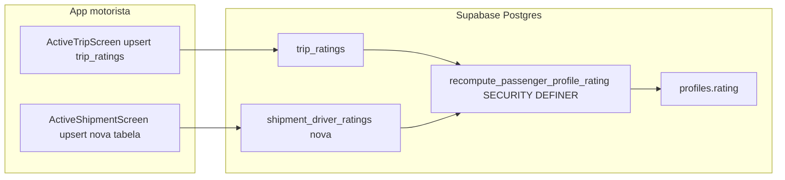

# Avaliação do motorista e média no perfil do passageiro

## Estado atual (problemas)

- **Viagem:** [`apps/motorista/src/screens/ActiveTripScreen.tsx`](apps/motorista/src/screens/ActiveTripScreen.tsx) grava em [`trip_ratings`](supabase/migrations/20260413120000_trip_ratings_and_trip_expenses.sql), mas **nenhum trigger/job** atualiza [`profiles.rating`](supabase/migrations/20250224000000_extend_profiles.sql). O cliente já exibe `profile.rating` em [`apps/cliente/src/screens/ProfileScreen.tsx`](apps/cliente/src/screens/ProfileScreen.tsx).
- **Encomenda:** [`apps/motorista/src/screens/encomendas/ActiveShipmentScreen.tsx`](apps/motorista/src/screens/encomendas/ActiveShipmentScreen.tsx) faz `insert` em `shipment_ratings`, cuja RLS só permite o **dono do envio** ([`20250304000001_shipment_ratings.sql`](supabase/migrations/20250304000001_shipment_ratings.sql)); o motorista é barrado. O código **ignora `error`**, dando falso sucesso.

## Decisões de produto (assumidas no plano)

- **`profiles.rating`:** uma única média (1 casa decimal) para o utilizador como **cliente**, combinando:
  - notas em **`trip_ratings`** em que exista reserva [`bookings`](supabase/migrations/20250227000001_create_bookings.sql) desse `user_id` com `status IN ('paid', 'confirmed')` (exclui `cancelled` e `pending`);
  - notas de motorista em **envios concluídos** (nova tabela abaixo).
- **Uma nota por viagem** (`trip_ratings` já tem `UNIQUE (trip_id, driver_id)`): cada passageiro elegível entra na média **uma vez por viagem**, mesmo com várias reservas (caso raro).
- **Comentários:** manter em BD; **não** é obrigatório expor comentário ao passageiro na v1 (só média no perfil). Opcional depois: política `SELECT` em `trip_ratings` para o passageiro ver só `rating` (view ou colunas mínimas).

## Arquitetura (fluxo)

## 1. Nova migration SQL (ficheiro novo em `supabase/migrations/`)

### 1.1 Tabela `shipment_driver_ratings`

- Colunas: `id`, `shipment_id` (FK `shipments`), `driver_id` (FK `auth.users`), `rating` 1–5, `comment`, `created_at`.
- `UNIQUE (shipment_id)` — uma avaliação do motorista por envio (alinha com o modal atual).
- **RLS:** `INSERT`/`UPDATE` com `driver_id = auth.uid()` e `EXISTS` em `shipments` com `id = shipment_id`, `driver_id = auth.uid()`, `status = 'delivered'` (e opcionalmente `base_id IS NULL` se quiserem restringir ao fluxo “motorista via viagem” e não confundir com preparador — **a alinhar contigo**: se preparador também usa este ecrã, incluir condição equivalente).
- **SELECT:** motorista vê a própria linha; cliente vê linha do seu `shipments.user_id`; admin read-only se já existir padrão em [`20250312000000_admin_readonly_policies.sql`](supabase/migrations/20250312000000_admin_readonly_policies.sql).

### 1.2 Função `public.recompute_passenger_profile_rating(p_user_id uuid)`

- `SECURITY DEFINER`, `SET search_path = public`, `REVOKE EXECUTE FROM PUBLIC` + `GRANT` só a `service_role` (ou ninguém — só chamada interna por triggers).
- CTE ou `UNION ALL` de:
  - `SELECT tr.rating::numeric FROM trip_ratings tr WHERE EXISTS (SELECT 1 FROM bookings b WHERE b.scheduled_trip_id = tr.trip_id AND b.user_id = p_user_id AND b.status IN ('paid', 'confirmed'))`;
  - `SELECT sdr.rating::numeric FROM shipment_driver_ratings sdr INNER JOIN shipments s ON s.id = sdr.shipment_id WHERE s.user_id = p_user_id`.
- `AVG` global sobre todas as linhas; `UPDATE profiles SET rating = ROUND(avg, 1), updated_at = now() WHERE id = p_user_id`; se zero linhas, `rating = NULL`.
- Respeitar `numeric(2,1)` e check 0–5 em [`profiles`](supabase/migrations/20250224000000_extend_profiles.sql).

### 1.3 Função auxiliar `public.recompute_passenger_ratings_for_trip(p_trip_id uuid)`

- `SELECT DISTINCT b.user_id FROM bookings b WHERE b.scheduled_trip_id = p_trip_id AND b.status IN ('paid', 'confirmed')`;
- Para cada `user_id`, chamar `recompute_passenger_profile_rating`.

### 1.4 Triggers

- `AFTER INSERT OR UPDATE OR DELETE ON trip_ratings` → `recompute_passenger_ratings_for_trip(NEW.trip_id ou OLD.trip_id)`.
- `AFTER INSERT OR UPDATE OR DELETE ON shipment_driver_ratings` → `recompute_passenger_profile_rating` do `shipments.user_id` afetado.
- **Opcional (v2 / se quiserem rigor máximo):** `AFTER UPDATE OF status ON bookings` quando o status deixa de ser elegível, recalcular `user_id` daquela reserva (evita média “fantasma” se cancelarem depois de existir `trip_rating`). Pode ficar fora da v1 se quiserem menos superfície.

### 1.5 Backfill

- No final da migration: `UPDATE` em lote dos `profiles` afetados com `EXISTS` em `trip_ratings` + `bookings` (e depois com `shipment_driver_ratings` quando vazia no dia zero não muda nada).

### 1.6 `trip_ratings` — leitura pelo passageiro (opcional v1)

- Nova policy `SELECT` em `trip_ratings`: `auth.uid()` tem reserva naquele `trip_id` (mesmos filtros de status), para suportar ecrã futuro “nota que o motorista deixou”.

## 2. App motorista — encomendas

Ficheiro: [`apps/motorista/src/screens/encomendas/ActiveShipmentScreen.tsx`](apps/motorista/src/screens/encomendas/ActiveShipmentScreen.tsx)

- Trocar `insert` em `shipment_ratings` por **`upsert`** em `shipment_driver_ratings` com `onConflict: 'shipment_id'`, preenchendo `driver_id` com `auth.getUser()`.
- Tratar `error` como em `ActiveTripScreen` (alerta + não fechar como sucesso se falhar).
- Reutilizar ou alinhar mensagens com [`apps/motorista/src/utils/errorMessage.ts`](apps/motorista/src/utils/errorMessage.ts) se a tabela não existir.

**Nota de escopo:** este ficheiro está no caminho `encomendas/`; a regra do repo diz para não alterar preparador “por acidente”. Aqui a alteração é **pedida explicitamente** para fechar o fluxo de avaliação.

## 3. App cliente (opcional na mesma entrega)

- Nada é **obrigatório** para a média aparecer (já lê `profiles.rating`).
- Se quiserem “100%” no sentido UX: ecrã de detalhe de viagem/envio mostrar a nota que o motorista deixou — exige `select` na nova policy + query no ecrã correspondente.

## 4. Verificação

- Aplicar migration no projeto de staging; concluir viagem com 1+ `bookings` pagos/confirmados; enviar avaliação; confirmar linha em `trip_ratings` e `profiles.rating` atualizado para cada `user_id` elegível.
- Entrega de envio com `driver_id` preenchido; enviar avaliação; confirmar `shipment_driver_ratings` e `profiles.rating` do `shipments.user_id`.
- Testar `upsert` (segunda submissão altera nota e recalcula média).

## Riscos / decisões a confirmar

- **Preparador vs motorista clássico em envios:** a condição RLS em `shipment_driver_ratings` deve refletir quem conclui o ecrã de avaliação no app (só `driver_id` do shipment, ou também worker preparador). Se só motorista “clássico”, `shipments.driver_id = auth.uid()` + `delivered` é suficiente.
- **Média mista viagem + envio:** um utilizador só cliente acumula as duas fontes; se quiserem médias separadas (“nota como passageiro” vs “nota como remetente”), seria preciso segunda coluna ou tabela de agregados — fora deste plano.
