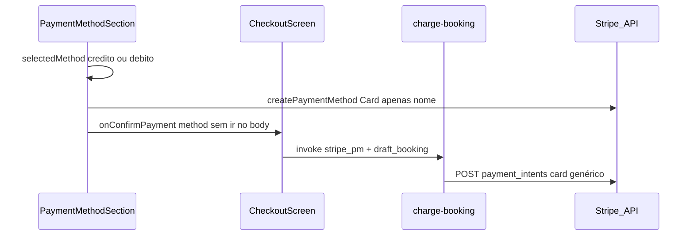

# Plano: Checkout — crédito, débito, Pix e Stripe

## O que o código faz hoje

### Cartão (crédito e débito) — viagem ([CheckoutScreen.tsx](apps/cliente/src/screens/trip/CheckoutScreen.tsx) + [charge-booking](supabase/functions/charge-booking/index.ts))

1. **Cliente** (`handleConfirmPayment`): para `credito` ou `debito`, o corpo do `supabase.functions.invoke('charge-booking', { body })` envia apenas `payment_method_id` **ou** `stripe_payment_method_id` e `draft_booking`. **Não envia** `params.method` nem equivalente (`credit_card` / `debit_card`).

2. **Tokenização** ([PaymentMethodSection.tsx](apps/cliente/src/components/PaymentMethodSection.tsx)): `createPaymentMethod({ paymentMethodType: 'Card', paymentMethodData: { billingDetails: { name } } })` — não há campo para “forçar” débito vs crédito. A API pública de criação de `PaymentMethod` tipo `card` expõe dados do plástico (`number`, `exp`, `cvc`, opcionalmente `card.networks.preferred` para **co-badged** cartes_bancaires/mastercard/visa), **não** um parâmetro `funding` editável; o `funding` do cartão vem da **inferência da Stripe/rede** a partir do BIN e do contexto da transação.

3. **Edge** `charge-booking`: o `PaymentIntent` é montado com `payment_method_types[0]=card`, `payment_method=<pm_…>`, `confirm=true`, sem `payment_method_options` específicos para distinguir crédito/débito.

**Conclusão técnica:** a UI muda rótulo, política de cancelamento e lista de cartões salvos (`payment_methods.type` = `credit` vs `debit` no Supabase), mas **a cobrança no Stripe é idêntica** nos dois casos: um `pm_` de tipo `card` sem sinalização adicional de funding. Em cartões **crédito/débito** no Brasil, transações **e-commerce** costumam ser roteadas como **crédito** quando o emissor/rede não oferece débito online distinto; o “saldo insuficiente” no fluxo “débito” pode ser o **mesmo fundo de crédito** (limite estourado), não a conta corrente.

### Pix e dinheiro — viagem (mesmo [CheckoutScreen.tsx](apps/cliente/src/screens/trip/CheckoutScreen.tsx))

- Se o método **não** é cartão, o fluxo cai no `else`: **insert direto** em `bookings` com `status: 'pending'` — **sem** `charge-booking`, **sem** PaymentIntent Pix (diferente de [ConfirmShipmentScreen.tsx](apps/cliente/src/screens/shipment/ConfirmShipmentScreen.tsx) + [charge-shipments](supabase/functions/charge-shipments/index.ts), onde Pix usa `payment_method_types=pix` e cobrança real).

- A tela seguinte ([PaymentConfirmedScreen.tsx](apps/cliente/src/screens/trip/PaymentConfirmedScreen.tsx)) só trata **dinheiro** de forma especial (`isCash`). Para **Pix**, o texto segue o ramo “pagamento confirmado” / “valor total pago”, embora a reserva tenha ficado **pending** sem pagamento online — risco de **cópia enganosa** e de método “não funcionar” no sentido financeiro.

## Verificação recomendada (após aprovação do plano / em staging)

1. No **Stripe Dashboard**, abrir um PaymentIntent de teste gerado pelo checkout e inspecionar o `PaymentMethod` → `card.funding` (`credit` vs `debit`) nas tentativas em que o usuário escolheu “débito” vs “crédito” com o **mesmo** PAN.
2. Opcional: log temporário no `charge-booking` após resolver o `pm_` (GET `/v1/payment_methods/:id`) gravando `card.funding` em **metadata** do PI para correlacionar com a escolha do app (hoje inexistente).

## Direções de correção (escopo sugerido)

| Área | Ação |
|------|------|
| **Observabilidade / contrato** | Incluir no body de `charge-booking` algo como `card_intent: 'credit' \| 'debit'` (ou `credit_card` / `debit_card`), validar no servidor, e preencher `metadata` no PaymentIntent (`requested_card_intent`, `user_id`, `scheduled_trip_id` já existem parcialmente). Isso **não muda** a rede sozinha, mas permite provar em log/dashboard se a intenção do app bate com o `funding` real. |
| **UX / validação** | Após `createPaymentMethod` (ou no edge antes de confirmar), se o usuário pediu **débito** e `card.funding === 'credit'`, retornar mensagem clara: cartão foi tratado como crédito online; sugerir **Pix** ou cartão só-débito — alinhado à limitação da API Stripe para combo em CNP. |
| **Brasil crédito** | Consultar [Stripe: installments no BR](https://docs.stripe.com/payments/installments) e avaliar `payment_method_options[card][installments]` só no ramo crédito (se produto exigir parcelamento/regras de rede); isso é ortogonal ao bug de combo, mas alinha o PI com práticas BR. |
| **Pix no checkout de viagem** | Decisão de produto: ou **remover** Pix do checkout de viagem até existir fluxo igual ao de envios, ou **implementar** criação de booking + edge de cobrança Pix (espelhar `charge-shipments` / status). |
| **Consistência envios** | `charge-shipments` já lê `payment_method` na linha do envio (`credito`/`debito`/`pix`), mas o **cartão** também usa o mesmo POST genérico em `/payment_intents` — o mesmo gap de funding aplica-se a encomendas. |

## Diagrama do fluxo atual (cartão viagem)

Não há ramo em que `selectedMethod` altere parâmetros do Stripe.

## Referências de código essenciais

- Corpo sem método de cartão: [CheckoutScreen.tsx](apps/cliente/src/screens/trip/CheckoutScreen.tsx) (invoke `charge-booking` ~407–427).
- `createPaymentMethod` sem funding: [PaymentMethodSection.tsx](apps/cliente/src/components/PaymentMethodSection.tsx) ~199–204.
- PI sem opções crédito/débito: [charge-booking/index.ts](supabase/functions/charge-booking/index.ts) ~447–459.
