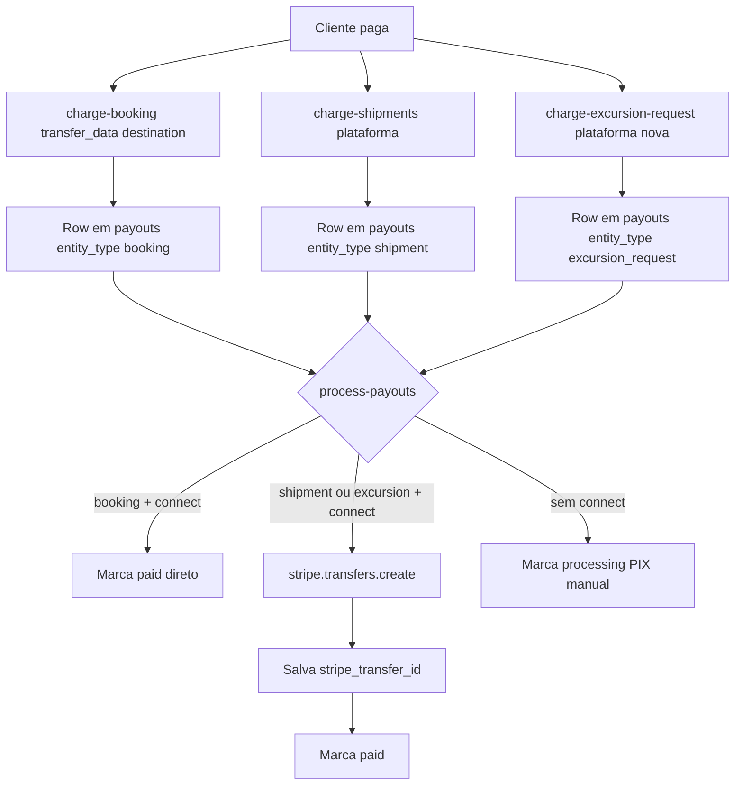

# Correcoes Stripe Connect por subtype do app Motorista

Implementacao das 5 lacunas documentadas em [docs/RLS_AUDIT_STRIPE_CONNECT_MOTORISTA.md](docs/RLS_AUDIT_STRIPE_CONNECT_MOTORISTA.md), organizada em fases incrementais e testaveis.

## Decisao arquitetural central (D1)

Transfer **explicito** via `stripe.transfers.create` dentro do `process-payouts`, **nao** `transfer_data` no momento do charge. Dinheiro fica retido na plataforma ate o payout.

**Consequencias coerentes:**
- Refund de shipment ficou simples: enquanto payout nao foi liberado, basta `POST /refunds` no PI (dinheiro ainda na plataforma). `process-refund` ja cancela payouts `pending/processing` — nao precisa tocar.
- `charge-booking` (viagens) permanece **inalterado** — ja funciona em producao com `transfer_data` no ato. Evita regressao em fluxo critico.
- `process-payouts` passa a ter duas regras:
  - `entity_type='booking'` + worker com Connect: manter heuristica atual ("transferido no charge", so marca `paid`).
  - `entity_type in ('shipment','excursion_request')` + worker com Connect: fazer `stripe.transfers.create` explicito e salvar `stripe_transfer_id` antes de marcar `paid`.



## Fase 1 — Infraestrutura de banco

### 1.1. Migration: idempotencia e rastreio de transfer

Nova migration `supabase/migrations/YYYYMMDD_payouts_stripe_transfer_columns.sql`:

```sql
alter table public.payouts
  add column if not exists stripe_transfer_id text null,
  add column if not exists stripe_transfer_at timestamptz null,
  add column if not exists stripe_transfer_error text null;

create unique index if not exists payouts_stripe_transfer_id_uniq
  on public.payouts (stripe_transfer_id)
  where stripe_transfer_id is not null;

comment on column public.payouts.stripe_transfer_id is
  'ID do stripe.transfers quando payout Connect foi liberado explicitamente (entity_type in shipment, excursion_request).';
```

### 1.2. Migration: preparer_payout_cents em excursion_requests (D3)

A tabela ja tem `driver_id`, `preparer_id`, `worker_payout_cents`. Precisa campo separado para preparador:

```sql
alter table public.excursion_requests
  add column if not exists preparer_payout_cents integer not null default 0;

comment on column public.excursion_requests.preparer_payout_cents is
  'Valor em centavos destinado ao preparador_id. worker_payout_cents passa a ser exclusivo do driver.';
```

### 1.3. Migration: view para dashboard admin (D5)

```sql
create or replace view public.admin_shipment_payouts_stuck as
select
  p.id as payout_id,
  p.worker_id,
  wp.subtype,
  p.entity_type,
  p.entity_id,
  p.worker_amount_cents,
  p.status,
  p.created_at,
  (now() - p.created_at) as age
from public.payouts p
join public.worker_profiles wp on wp.id = p.worker_id
where p.status in ('pending','processing')
  and p.entity_type in ('shipment','excursion_request')
  and (now() - p.created_at) > interval '3 days';

-- RLS: acessivel apenas via service_role ou admin (replicar padrao das outras views admin).
```

## Fase 2 — D1: Transfer explicito no process-payouts

### 2.1. Atualizar [supabase/functions/process-payouts/index.ts](supabase/functions/process-payouts/index.ts)

No branch `if (hasConnect)` (linhas 213-236), substituir lógica atual por:

```ts
// Pseudo-codigo — detalhes finais na implementacao
if (hasConnect) {
  const needsExplicitTransfer =
    workerPayouts.some(p => p.entity_type === 'shipment' || p.entity_type === 'excursion_request');
  const bookingOnly = workerPayouts.every(p => p.entity_type === 'booking');

  if (bookingOnly) {
    // Comportamento atual preservado: transfer ja aconteceu no charge via transfer_data.
    // Marca paid e loga stripe_connect_transfer_at_charge como antes.
  } else {
    // Processar individualmente — agrupar cria ambiguidade de idempotencia.
    for (const p of workerPayouts) {
      if (p.entity_type === 'booking') {
        // mesmo comportamento antigo
      } else {
        // Novo: stripe.transfers.create
        const idemKey = `payout_${p.id}`;
        const transfer = await stripeFetch(stripeSecret, 'POST', '/transfers',
          new URLSearchParams({
            amount: String(p.worker_amount_cents),
            currency: 'brl',
            destination: worker.stripe_connect_account_id,
            'metadata[payout_id]': p.id,
            'metadata[entity_type]': p.entity_type,
            'metadata[entity_id]': p.entity_id,
          }),
          { 'Idempotency-Key': idemKey }
        );

        await admin.from('payouts').update({
          status: 'paid',
          paid_at: now,
          stripe_transfer_id: transfer.id,
          stripe_transfer_at: now,
        }).eq('id', p.id);

        await admin.from('payout_logs').insert({
          payout_id: p.id,
          action: 'auto_released',
          performed_by: performedBy,
          details: { method: 'stripe_connect_explicit_transfer', stripe_transfer_id: transfer.id },
        });
      }
    }
  }
}
```

Precisa: adicionar helper `stripeFetch` com suporte a `Idempotency-Key` (seguir padrao de `charge-shipments`).

Tratamento de erro: se `stripe.transfers.create` falhar, salvar `stripe_transfer_error` e deixar payout `processing` para retry manual. Nao rollback — erro fica visivel para admin.

### 2.2. Impacto em [supabase/functions/process-refund/index.ts](supabase/functions/process-refund/index.ts)

Adicionar logica defensiva: se o payout associado ja tem `stripe_transfer_id` (`status='paid'`), chamar `POST /transfers/{id}/reversals` antes do refund no PI.

```ts
// depois de localizar o payout via entity_type/entity_id:
if (payout?.stripe_transfer_id && payout.status === 'paid') {
  await stripeFetch(stripeSecret, 'POST',
    `/transfers/${payout.stripe_transfer_id}/reversals`,
    new URLSearchParams({ amount: String(refundAmount), 'metadata[reason]': 'refund_chain' })
  );
}
```

Se o payout ainda estava `pending/processing`, o `update` ja existente (linhas 228-237) cancela sem precisar reverter nada — OK.

## Fase 3 — D3: Cobranca de excursion_requests

### 3.1. Nova edge function `charge-excursion-request`

Criar [supabase/functions/charge-excursion-request/index.ts](supabase/functions/charge-excursion-request/index.ts) espelhando a estrutura de `charge-shipments`:
- Aceita JWT do cliente (`user_id` dono do `excursion_request`).
- Le `excursion_requests` pelo id (status deve ser aceito/orcado).
- Cria `PaymentIntent` com `amount = total_amount_cents`, metadata `excursion_request_id`, sem `transfer_data` (cobranca centralizada).
- Suporte PIX + cartao (mesmo padrao de `charge-shipments`).
- Atualiza `stripe_payment_intent_id` no registro.

Nao fazer split no PI — split acontece via transfers explicitos no payout.

### 3.2. Webhook handler em [supabase/functions/stripe-webhook/index.ts](supabase/functions/stripe-webhook/index.ts)

Estender `extractEntityRef` e `handlePaymentIntentSucceeded` para reconhecer `metadata.excursion_request_id`:

```ts
// extractEntityRef
const excursion = metadata?.excursion_request_id?.trim();
if (excursion) return { table: 'excursion_requests', id: excursion };
```

No `handlePaymentIntentSucceeded`, apos marcar `status='paid'` em `excursion_requests`, **criar 2 rows em `payouts`**: uma para `driver_id` (valor `worker_payout_cents`) e outra para `preparer_id` (valor `preparer_payout_cents`), ambas com `entity_type='excursion_request'`, `entity_id=<excursion_id>`, `status='pending'`.

### 3.3. Atualizar `manage-excursion-budget`

Verificar [supabase/functions/manage-excursion-budget/index (1).ts](supabase/functions/manage-excursion-budget/index.ts) para:
- Preencher `preparer_payout_cents` ao finalizar o orcamento (decisao de valor fica com quem chama; o campo so precisa ser populado).
- Sanity check: `worker_payout_cents + preparer_payout_cents + platform_fee_cents == total_amount_cents`.

## Fase 4 — D4: Deep link de notificacao por subtype

### 4.1. Identificar nomes das rotas

Verificar os `RootNavigator`/tabs de `MainEncomendas` e `MainExcursoes` para achar a tela equivalente a `Payments`. Provavelmente existe `PagamentosEncomendasScreen` e `PagamentosExcursoesScreen` ja registradas.

### 4.2. Atualizar [supabase/functions/stripe-webhook/index.ts](supabase/functions/stripe-webhook/index.ts)

No `handleAccountUpdated`, antes de inserir a notificacao, ler `subtype` do `worker_profiles` (ja esta no SELECT `before`) e mapear:

```ts
function routeForSubtype(subtype: string | null): string {
  if (subtype === 'shipments') return 'PagamentosEncomendas';
  if (subtype === 'excursions') return 'PagamentosExcursoes';
  return 'Payments';
}

// payload data:
data: { route: routeForSubtype(subtype) }
```

### 4.3. Espelhar em [supabase/functions/stripe-connect-sync/index.ts](supabase/functions/stripe-connect-sync/index.ts)

Mesma logica. Ja lemos `subtype` no SELECT, basta adicionar a funcao.

## Fase 5 — D2: PRD atualizado

Atualizar [apps/motorista/PRD.md](apps/motorista/PRD.md):

- Secao "Liberacao do app": explicar que aceita `active` **e** `in_review`.
- Secao sobre os 4 subtypes: incluir texto que `takeme`/`partner` sao `role='driver'`, `shipments`/`excursions` sao `role='preparer'`.
- Nova secao **"Modelo de recebimento"**:
  - Viagens: split no ato do charge via `transfer_data`.
  - Encomendas e excursoes-orcamento: cobranca centralizada + transfer explicito no payout.
- Documentar os campos novos em `payouts` (`stripe_transfer_id`, etc.) e em `excursion_requests` (`preparer_payout_cents`).

## Fase 6 — D5: Alerta admin de payout retido

### 6.1. Tela/card no admin

Adicionar consulta da view `admin_shipment_payouts_stuck` (criada em 1.3) em uma tela ja existente de payouts no app admin. Listar com aviso visual (linha vermelha/amarela). Localizacao exata a definir olhando `apps/admin/src/screens/`.

### 6.2. Cron leve (opcional, mesmo plano)

Se houver cron de notificacoes admin ja montado (ver `notify-driver-upcoming-trips` como template), adicionar cron diario que consulta a view e insere `notifications` com `target_app_slug='admin'` quando n > 0. Se nao existir infra de push admin, pular e contentar com a view no dashboard.

## Fase 7 — Deploy e validacao

Nesta ordem, para evitar inconsistencia de schema vs codigo:

1. Aplicar as 3 migrations (1.1, 1.2, 1.3) via MCP `apply_migration`.
2. Deploy de `process-payouts` (versao nova).
3. Deploy de `process-refund` (versao com reversal).
4. Deploy de `charge-excursion-request` (nova funcao).
5. Deploy de `stripe-webhook` (handler excursion + deep link por subtype).
6. Deploy de `stripe-connect-sync` (deep link por subtype).
7. Deploy de `manage-excursion-budget` (preparer_payout_cents).

Validacao manual (sem gastar dinheiro real):
- Rodar `process-payouts` com `dry_run=true` para cada entity_type.
- Simular `account.updated` via Stripe CLI em `test mode` para o user `takeme/in_review` e confirmar que o push chega com deep link `Payments`.
- Repetir simulando um user `shipments` e confirmar deep link `PagamentosEncomendas`.

## Entregaveis

- 3 migrations novas em `supabase/migrations/`
- Funcoes tocadas: `process-payouts`, `process-refund`, `stripe-webhook`, `stripe-connect-sync`, `manage-excursion-budget`
- Funcao nova: `charge-excursion-request`
- PRD atualizado
- View admin + tela/card de alerta

## Fora de escopo

- **Nao tocar em `charge-booking`** (fluxo de viagens em producao, funciona como esta).
- Nao alterar gate por subtype — todos continuam obrigados a completar Connect (coerente com modelo de transfer explicito).
- Nao mexer em `dispatch-notification-fcm` (deep link e payload data, nao precisa mudar).
- Nao alterar configuracao de webhook Stripe no dashboard (ja foi feito em sessao anterior).