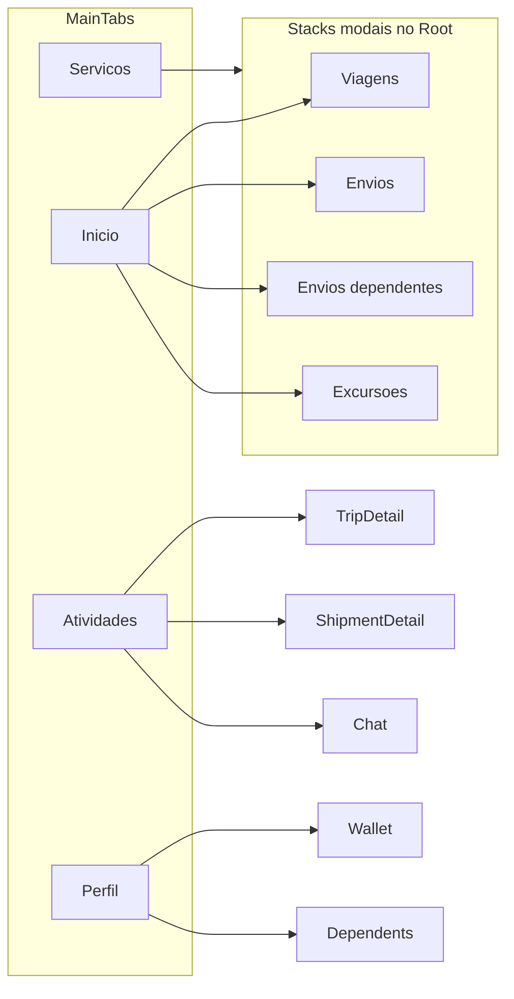

# Diagnóstico do aplicativo Take Me — Cliente

Este documento resume o estado do app em [apps/cliente](apps/cliente) (Expo / React Native), com base na navegação, telas e integrações presentes no código. Serve como base para apresentação ao cliente; itens “faltando” misturam **pendências de produto no app**, **cópia/UI** e **dependências de infraestrutura** (Supabase, Stripe, Mapbox, builds).

---

## 1. Visão geral técnica

- **Stack:** Expo SDK 54, React Native 0.81, React 19, TypeScript, React Navigation (tabs + stacks nativos).
- **Backend / dados:** Supabase (Auth, Postgres, Storage, Edge Functions consumidas pelo app).
- **Mapas:** `@rnmapbox/maps` + token `EXPO_PUBLIC_MAPBOX_ACCESS_TOKEN` (estilo compartilhado via pacote `@take-me/shared`).
- **Pagamentos:** `@stripe/stripe-react-native` com carregamento condicional — em [apps/cliente/src/lib/stripeNativeBridge.tsx](apps/cliente/src/lib/stripeNativeBridge.tsx) o Stripe só funciona em **binário com módulo nativo** (dev build / EAS); Expo Go e Web mostram fallback (“cartão indisponível neste ambiente”).
- **Atualizações OTA:** `expo-updates` configurado em [apps/cliente/app.json](apps/cliente/app.json) (EAS project id + `runtimeVersion`).
- **Idioma:** interface em **português** (strings fixas no código; sem framework i18n).
- **Versões:** [apps/cliente/package.json](apps/cliente/package.json) indica `1.0.5`; [apps/cliente/app.json](apps/cliente/app.json) indica `version` `1.0.0` — possível inconsistência a alinhar na loja/build.

---

## 2. O que o app já contém (por área)

### 2.1 Autenticação e onboarding

- Fluxo **Welcome**, **Login**, **Cadastro**, **Verificação de e-mail**.
- **Recuperação de senha** (e-mail enviado, reset, sucesso) e handler de deep link em [apps/cliente/App.tsx](apps/cliente/App.tsx) + [apps/cliente/src/navigation/AuthRecoveryHandler.tsx](apps/cliente/src/navigation/AuthRecoveryHandler.tsx).
- Após cadastro: fluxo de **cartão / método de pagamento** no root ([apps/cliente/src/navigation/RootNavigator.tsx](apps/cliente/src/navigation/RootNavigator.tsx)): prompt, método, cartão, sucesso.
- **Termos de uso** e **Política de privacidade** (telas dedicadas e também acessíveis pelo perfil).

### 2.2 Navegação principal (4 abas)

Definido em [apps/cliente/src/navigation/MainTabs.tsx](apps/cliente/src/navigation/MainTabs.tsx):

| Aba | Função resumida |
|-----|-----------------|
| **Início** | Atalhos para os quatro serviços, destinos recentes, fluxo “agora / agendar” com seleção de data e faixas de horário. |
| **Serviços** | Mesmos quatro serviços em grade ([apps/cliente/src/screens/ServicesScreen.tsx](apps/cliente/src/screens/ServicesScreen.tsx)). |
| **Atividades** | Lista unificada de reservas, envios, envios de dependentes e solicitações de excursão; filtros persistidos em `user_preferences`; FAB de suporte ([apps/cliente/src/screens/ActivitiesScreen.tsx](apps/cliente/src/screens/ActivitiesScreen.tsx)). |
| **Perfil** | Stack completo de conta (ver secção 2.5). |

### 2.3 Viagens (TripStack)

Registrado em [apps/cliente/src/navigation/TripStack.tsx](apps/cliente/src/navigation/TripStack.tsx) e tipos em [apps/cliente/src/navigation/types.ts](apps/cliente/src/navigation/types.ts):

- **Planejar viagem** (`PlanTrip`), **origem/destino e rota** (`PlanRide`), **escolha de horário** (`ChooseTime`), **busca de motorista/viagem** (`SearchTrip`), **confirmar detalhes** (`ConfirmDetails`), **checkout** com Stripe (`Checkout`), **pagamento confirmado** (`PaymentConfirmed`).
- **Acompanhamento:** `DriverOnTheWay`, `TripInProgress`, **avaliação** (`RateTrip`).
- Integração com localização via [apps/cliente/src/contexts/CurrentLocationContext.tsx](apps/cliente/src/contexts/CurrentLocationContext.tsx) e mapas nos ecrãs de viagem.

**Nota de produto:** existe a rota `WhenNeeded` no stack, mas **não há navegação** no cliente que a abra (apenas registo no `TripStack`) — tela potencialmente **órfã** ou legado.

### 2.4 Envios e envios de dependentes

- **Envios:** endereços → destinatário/cotação → escolha de motorista (quando aplicável) → confirmação → sucesso ([apps/cliente/src/navigation/ShipmentStack.tsx](apps/cliente/src/navigation/ShipmentStack.tsx)).
- **Envios de dependentes:** formulário → cadastro de dependente (reutiliza ecrã do perfil) → definir viagem → confirmar → sucesso ([apps/cliente/src/navigation/DependentShipmentStack.tsx](apps/cliente/src/navigation/DependentShipmentStack.tsx)).
- Cobrança de envio: há comentário explícito sobre **slug da Edge Function** alinhado ao deploy em [apps/cliente/src/lib/supabaseEdgeFunctionNames.ts](apps/cliente/src/lib/supabaseEdgeFunctionNames.ts) (`charge-shipments` vs pasta `charge-shipment` no repo) — risco operacional se deploy e código divergirem.

### 2.5 Excursões

- Stack mínimo: **pedido** + **sucesso** ([apps/cliente/src/navigation/ExcursionStack.tsx](apps/cliente/src/navigation/ExcursionStack.tsx)).
- Gestão pós-pedido no **stack de Atividades:** detalhe, orçamento, lista e formulário de passageiros ([apps/cliente/src/navigation/ActivitiesStack.tsx](apps/cliente/src/navigation/ActivitiesStack.tsx)).

### 2.6 Atividades, histórico e detalhe de viagem

- Lista rica com categorias e filtros por data.
- **Histórico de viagens** separado ([apps/cliente/src/screens/TravelHistoryScreen.tsx](apps/cliente/src/screens/TravelHistoryScreen.tsx)) dentro do stack de atividades.
- **Detalhe da viagem** (`TripDetailScreen`): mapa, passageiros, encomendas vinculadas à viagem, cancelamento com chamada ao backend, chat com motorista/suporte, ações de gorjeta/avaliação na UI (ver lacunas abaixo).

### 2.7 Chat e suporte

- **Chat** com anexos (imagem, documento, áudio via `expo-av`) em [apps/cliente/src/screens/ChatScreen.tsx](apps/cliente/src/screens/ChatScreen.tsx) e componentes em `src/components/chat/`.
- **Lista de conversas** no perfil; abertura a partir de atividades e detalhe de viagem/envio.
- **Support sheet** e tickets em [apps/cliente/src/lib/supportTickets.ts](apps/cliente/src/lib/supportTickets.ts).

### 2.8 Perfil, carteira e dependentes

Stack em [apps/cliente/src/navigation/ProfileStack.tsx](apps/cliente/src/navigation/ProfileStack.tsx):

- Dados pessoais, edição modal de nome, e-mail, telefone, CPF, localização, avatar, palavra-passe.
- **Carteira** e gestão de **métodos de pagamento** / eliminar cartão.
- **Dependentes:** lista, detalhe, adicionar, eliminar, fluxo de sucesso.
- **Eliminar conta** (dois passos).
- **Sobre**, políticas (cancelamento, consentimento onde aplicável).

### 2.9 Notificações

- **Centro de notificações** lê a tabela `notifications` no Supabase ([apps/cliente/src/screens/profile/NotificationsScreen.tsx](apps/cliente/src/screens/profile/NotificationsScreen.tsx)).
- **Preferências** (vários canais lógicos) gravadas em `notification_preferences` ([apps/cliente/src/screens/profile/ConfigureNotificationsContent.tsx](apps/cliente/src/screens/profile/ConfigureNotificationsContent.tsx)).
- **Não foi encontrado** uso de `expo-notifications` / registo de push token no app cliente — ou seja, as preferências e a lista assumem **notificações in-app / backend**; **push nativo** não está evidenciado neste código.

### 2.10 Componentes transversais

- Mapa Mapbox reutilizável, marcadores, polilinhas.
- Autocomplete de moradas, modais de confirmação, bottom sheets animados, grelha de ícones no perfil, formatação de erros de pagamento ([apps/cliente/src/utils/errorMessage.ts](apps/cliente/src/utils/errorMessage.ts)).

---

## 3. Lacunas, incompletos e pontos de atenção (para o cliente)

### 3.1 Funcionalidades visíveis mas não concluídas no código

- **Reagendar viagem** em [apps/cliente/src/screens/trip/TripDetailScreen.tsx](apps/cliente/src/screens/trip/TripDetailScreen.tsx): o botão “Confirmar reagendamento” apenas fecha o sheet; há comentário `TODO: confirm reschedule` — **sem persistência/API**.
- **Gorjeta** na mesma tela: botão “Gorjeta” **sem `onPress`** (apenas UI).
- **Comprovante de despesa:** área “Envie o comprovante da despesa” **sem ação** associada.
- **Resumo final:** “Duração” e “Distância” como **“—”** (placeholders, não calculados nesta UI).

### 3.2 UX / conteúdo

- Em [apps/cliente/src/screens/HomeScreen.tsx](apps/cliente/src/screens/HomeScreen.tsx) e [apps/cliente/src/screens/ServicesScreen.tsx](apps/cliente/src/screens/ServicesScreen.tsx), os **ícones** dos cartões “Envios de dependentes” e “Excursões” estão **trocados** (`icon-excursoes` vs `icon-dependentes` nos `require`) — impacto direto na perceção do produto.

### 3.3 Ambiente e distribuição

- **Pagamento com cartão** exige **development build / loja** com Stripe nativo; não é cenário completo no Expo Go (mensagem explícita no bridge).
- **Web:** script `expo start --web` existe no `package.json`, mas Mapbox/Stripe nativos limitam paridade com iOS/Android — validar se Web é requisito de negócio.
- **Alinhamento de versão** entre `app.json` e `package.json` (comunicação com lojas e OTA).

### 3.4 Dependências de backend não inferidas só pelo app

- Comportamento real de **cancelamento, reembolso, reagendamento**, **gorjetas**, **notificações push** e **edge functions** depende das políticas/RPCs/triggers no Supabase e dos nomes deployados das functions (ex.: slug de cobrança de envio).

---

## 4. Como usar este relatório na apresentação

- **“Já entregue”:** secções 2.1–2.10 (fluxos principais, mapas, pagamento em build nativo, chat, perfil, atividades unificadas).
- **“Em aberto no app”:** secção 3.1 (itens com evidência direta de TODO ou handler vazio).
- **“Ajustes rápidos de qualidade”:** 3.2 e 3.3.
- **“Contrato com backend/ops”:** 3.4 e comentário do slug `charge-shipments` em [apps/cliente/src/lib/supabaseEdgeFunctionNames.ts](apps/cliente/src/lib/supabaseEdgeFunctionNames.ts).

Nenhuma alteração de código foi feita; este plano é apenas o diagnóstico para aprovação ou evolução em tarefas de implementação.
