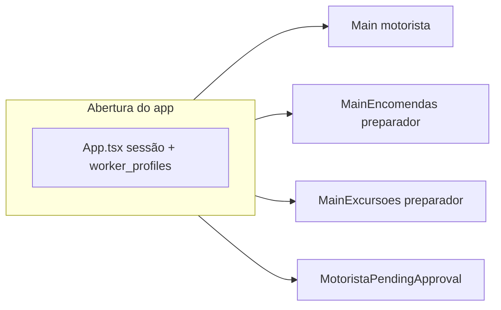

# Diagnóstico: aplicativo Take Me Motorista

## Contexto técnico

- **Monorepo:** [`apps/motorista`](apps/motorista) — React Native + Expo, Supabase, mapas (Mapbox em `@rnmapbox/maps`, com fallbacks de rota no shared/lib de rota).
- **Um único binário**, **três “ambientes”** de uso após login, escolhidos pelo **`worker_profiles.subtype`** no banco (ver [`apps/motorista/src/lib/motoristaAccess.ts`](apps/motorista/src/lib/motoristaAccess.ts) e bootstrap em [`apps/motorista/App.tsx`](apps/motorista/App.tsx)):
  - `takeme` ou `partner` → fluxo **motorista** (`Main` / [`MainTabs.tsx`](apps/motorista/src/navigation/MainTabs.tsx))
  - `shipments` → **preparador de encomendas** (`MainEncomendas` / [`MainTabsEncomendas.tsx`](apps/motorista/src/navigation/MainTabsEncomendas.tsx))
  - `excursions` → **preparador de excursões** (`MainExcursoes` → [`MainExcursoesEntry.tsx`](apps/motorista/src/screens/excursoes/MainExcursoesEntry.tsx) com boas-vindas opcional + [`MainTabsExcursoes.tsx`](apps/motorista/src/navigation/MainTabsExcursoes.tsx))

**Nota para o cliente:** O documento interno [`apps/motorista/PRD.md`](apps/motorista/PRD.md) (seção 12 “Faltando”) está **desatualizado** — por exemplo, já existem `useTripStops` com RPC `generate_trip_stops`, `ActiveTripScreen` usando esse hook, `HomeExcursoesScreen` com dados reais do Supabase, `NotificationsScreen` com query em `notifications`, etc. O relatório abaixo prioriza o **código atual**.

---

## 1. O que o app contém (transversal)

| Área | Situação |
|------|----------|
| **Autenticação** | Welcome, login, cadastro por tipo, verificação de e-mail, recuperação de senha, termos/privacidade (stack em [`RootNavigator.tsx`](apps/motorista/src/navigation/RootNavigator.tsx)). |
| **Gate de acesso** | `status === 'approved'` libera o app; caso contrário [`MotoristaPendingApprovalScreen`](apps/motorista/src/screens/MotoristaPendingApprovalScreen.tsx). Erro / perfil ausente → sign-out (em [`motoristaAccess.ts`](apps/motorista/src/lib/motoristaAccess.ts)). |
| **Cadastro por perfil** | Motorista (Take Me / parceiro): [`CompleteDriverRegistrationScreen`](apps/motorista/src/screens/CompleteDriverRegistrationScreen.tsx). Preparadores: [`CompletePreparadorEncomendasScreen`](apps/motorista/src/screens/CompletePreparadorEncomendasScreen.tsx), [`CompletePreparadorExcursoesScreen`](apps/motorista/src/screens/CompletePreparadorExcursoesScreen.tsx). Mapeamento DB: [`motoristaRegistration.ts`](apps/motorista/src/lib/motoristaRegistration.ts) (`take_me`→`takeme`, `parceiro`→`partner`). |
| **Mapas e navegação em viagem/coleta** | Componentes em [`src/components/googleMaps/`](apps/motorista/src/components/googleMaps), rotas/ETA em [`src/lib/route.ts`](apps/motorista/src/lib/route.ts). |
| **Chat** | Thread com Realtime em [`ChatScreen.tsx`](apps/motorista/src/screens/ChatScreen.tsx); conversas listadas; fluxos específicos por booking/shipment/excursão (libs `bookingConversation`, `shipmentConversation`, `excursionClientConversation`). |
| **Notificações in-app** | [`NotificationsScreen.tsx`](apps/motorista/src/screens/NotificationsScreen.tsx): lista `notifications` + preferências `notification_preferences`. |
| **Realtime parcial** | Chat (mensagens) e aba Home motorista com canal em [`useDriverOngoingTripForTabs.ts`](apps/motorista/src/hooks/useDriverOngoingTripForTabs.ts). Não há padrão uniforme de Realtime em todas as listas críticas. |
| **Pagamentos (motorista)** | [`PaymentsScreen.tsx`](apps/motorista/src/screens/PaymentsScreen.tsx) — integração com fluxo de conta/repasse (Stripe/onboarding conforme implementação atual). Stacks equivalentes nos ambientes preparador: [`PagamentosEncomendasStack`](apps/motorista/src/navigation/PagamentosEncomendasStack.tsx), [`PagamentosExcursoesStack`](apps/motorista/src/navigation/PagamentosExcursoesStack.tsx). |

---

## 2. Motorista Take Me vs parceiro (`subtype` `takeme` / `partner`)

**O que é igual hoje**

- Mesma **árvore de telas** (`MainTabs`: Início, Pagamentos, Atividades, Perfil).
- Mesmas capacidades operacionais observadas no código: **home com viagem ativa**, **solicitações pendentes**, **detalhe de viagem**, **viagem ativa no mapa**, **histórico**, **rotas e veículos**, **atividades** (feed em [`ActivitiesScreen.tsx`](apps/motorista/src/screens/ActivitiesScreen.tsx)), **chat pós-aceite**.

**O que difere na prática**

- **Rótulo de perfil** (ex.: “Parceiro TakeMe” em [`ProfileOverviewScreen.tsx`](apps/motorista/src/screens/ProfileOverviewScreen.tsx) / dados LGPD em [`DataRequestScreen.tsx`](apps/motorista/src/screens/DataRequestScreen.tsx)).
- **Tipo gravado no cadastro** influencia `worker_profiles.subtype` (`partner` vs `takeme`) — útil para **regras de negócio, precificação e relatórios no backend/admin**, não para um segundo app.

**Pontos de atenção (produto/operacional)**

- Em **Minhas rotas**, a ação **“Importar rotas da Take Me”** ([`WorkerRoutesScreen.tsx`](apps/motorista/src/screens/WorkerRoutesScreen.tsx)) usa a tabela `takeme_routes` **sem bloquear explicitamente** por subtype no trecho lido — vale **definir com o cliente** se parceiros devem ver/usar esse import ou se deve ser só frota Take Me.
- **Solicitações pendentes** ([`PendingRequestsScreen.tsx`](apps/motorista/src/screens/PendingRequestsScreen.tsx)): fluxo implementado com **updates diretos** em `bookings` / `shipments` / `worker_assignments` e **RPCs** para ofertas de encomenda (`shipment_driver_accept_offer`, `shipment_driver_pass_offer`, `shipment_process_expired_driver_offers`) — **não** usa a Edge Function `respond-assignment` citada no PRD. Para o cliente: alinhar se o **caminho oficial** de aceite/recusa + **estorno Stripe** está 100% coberto por essas RPCs/policies ou se ainda falta convergência com a função documentada.

**Outros detalhes**

- **Contagem regressiva** até limite (ex.: 30 min antes da partida) está implementada no UI de pendentes.
- **Avaliação pós-viagem** (`trip_ratings`): código em [`ActiveTripScreen.tsx`](apps/motorista/src/screens/ActiveTripScreen.tsx) com tratamento explícito se a **migração** não existir no projeto Supabase (ver mensagens em [`errorMessage.ts`](apps/motorista/src/utils/errorMessage.ts)).

---

## 3. Preparador de encomendas (`subtype === 'shipments'`)

**Abas inferiores:** Início | Coletas (stack) | Chat | Pagamentos | Perfil ([`MainTabsEncomendas.tsx`](apps/motorista/src/navigation/MainTabsEncomendas.tsx)).

**Implementado (alto nível)**

- **Início** com fila/solicitações ligada ao preparador e base ([`HomeEncomendasScreen.tsx`](apps/motorista/src/screens/encomendas/HomeEncomendasScreen.tsx) + [`preparerEncomendasBase.ts`](apps/motorista/src/lib/preparerEncomendasBase.ts)).
- **Coletas:** lista, histórico no stack ([`ColetasEncomendasStack.tsx`](apps/motorista/src/navigation/ColetasEncomendasStack.tsx)), **detalhe com mapa/rota**, **execução em mapa** ([`ActiveShipmentScreen.tsx`](apps/motorista/src/screens/encomendas/ActiveShipmentScreen.tsx)) com lógica de **coleta na base vs origem**, confirmação por **código** (função local `shipmentCodesMatch`).
- **Chat** dedicado (stack [`ChatEncomendasStack.tsx`](apps/motorista/src/navigation/ChatEncomendasStack.tsx)).
- **Pagamentos** (stack próprio).
- **Perfil** preparador ([`PerfilEncomendasStack.tsx`](apps/motorista/src/navigation/PerfilEncomendasStack.tsx)).

**Lacunas / riscos a comunicar ao cliente**

1. **Validação de código:** o PRD fala em Edge `confirm-code`; no fluxo atual de [`ActiveShipmentScreen`](apps/motorista/src/screens/encomendas/ActiveShipmentScreen.tsx) a checagem é **comparando código no cliente** (`shipmentCodesMatch`). Para **segurança e auditoria**, o ideal é **confirmar no servidor** (Edge Function ou RPC) quando o produto exigir.
2. **Documentação interna vs UX:** o PRD listava aba “Histórico” na barra; na UI atual o **histórico está dentro do stack Coletas**, não como aba separada — apenas ajuste de expectativa de layout.

---

## 4. Preparador de excursões (`subtype === 'excursions'`)

**Abas inferiores:** Início | Excursões (stack) | Chat | Pagamentos | Perfil ([`MainTabsExcursoes.tsx`](apps/motorista/src/navigation/MainTabsExcursoes.tsx)).

**Implementado**

- **Boas-vindas** na primeira entrada ([`MainExcursoesEntry.tsx`](apps/motorista/src/screens/excursoes/MainExcursoesEntry.tsx)).
- **Home** com dados reais e filtros ([`HomeExcursoesScreen.tsx`](apps/motorista/src/screens/excursoes/HomeExcursoesScreen.tsx)).
- **Stack de excursões:** lista, histórico, **detalhe com mapa**, fluxo de **embarques** ([`RealizarEmbarquesScreen.tsx`](apps/motorista/src/screens/excursoes/RealizarEmbarquesScreen.tsx)), **cadastro de passageiro** ([`CadastrarPassageiroExcursaoScreen.tsx`](apps/motorista/src/screens/excursoes/CadastrarPassageiroExcursaoScreen.tsx)), tela de **embarque concluído**.
- **Perfil** reutiliza grande parte do stack de perfil do motorista (tipos em [`types.ts`](apps/motorista/src/navigation/types.ts) — ex. `ExcursionSchedule`).

**Lacunas explícitas no app**

- **Upload de foto opcional do passageiro:** ainda mostra *“em breve”* ([`CadastrarPassageiroExcursaoScreen.tsx`](apps/motorista/src/screens/excursoes/CadastrarPassageiroExcursaoScreen.tsx) linhas ~40–41).
- **Documento (RG/CNH):** mensagem de que **será em versão futura** (mesmo ficheiro, `onUploadDoc`).
- **Polimento de produto:** checar com operação se **check-in/check-out** e nomenclatura de status no app estão 100% alinhados ao modelo final em `excursion_passengers` (o PRD já registrou divergências históricas de nomenclatura vs admin).

---

## 5. Itens “ainda falta” ou fracos (visão cliente)

| Tema | Detalhe |
|------|---------|
| **Push notifications (fora do app)** | Não há uso de `expo-notifications` (ou equivalente) no pacote motorista pesquisado — notificações são **in-app** + dependem do servidor popular `notifications`. |
| **Badge de não lidas** | [`SettingsScreen`](apps/motorista/src/screens/SettingsScreen.tsx) não exibe contagem na entrada “Notificações”; o usuário precisa abrir a tela. |
| **Cobertura Realtime** | Existe em **chat** e **indicador de viagem ativa na tab**; **não** há garantia de atualização em tempo real em pendentes, paradas ou listas longas sem pull-to-refresh/polling. |
| **Convergência backend** | PRD/PLANO citam `respond-assignment` e `confirm-code`; o app motorista **já opera** com caminhos alternativos (SQL direto + RPCs). Documentar qual é o **contrato oficial** com financeiro/antifraude. |
| **Telas placeholder** | [`ProfileStack`](apps/motorista/src/navigation/ProfileStack.tsx) inclui rota genérica `Placeholder` — revisar se ainda há atalhos expostos ao usuário final. |
| **Números de suporte** | Em `ActivitiesScreen` há placeholders `+5583999999999` — validar antes de ir a produção. |
| **Splash dentro do navigator** | [`SplashScreen.tsx`](apps/motorista/src/screens/SplashScreen.tsx) no stack ainda redireciona de forma simplificada se alguém navegar até ela; o fluxo real de cold start é **`App.tsx`**. Risco baixo, mas documentação interna deve alinhar. |

---

## 6. Sugestão de slides para a apresentação ao cliente

1. **Um app, três papéis** (motorista frota, motorista parceiro, dois preparadores) com a mesma base técnica.  
2. **Jornada motorista:** disponibilidade → pendentes → detalhe → viagem ativa → pagamentos/atividades/perfil.  
3. **Jornada preparador encomendas:** fila → execução com mapa e códigos → chat e pagamentos.  
4. **Jornada preparador excursões:** agenda → detalhe/embarques → cadastro de passageiros → conclusão.  
5. **Riscos/decisões pendentes:** validação de código no servidor, política de import de rotas Take Me para parceiro, push + badge, alinhamento financeiro com funções documentadas vs implementadas.

---

## Arquivos de referência rápida

- Navegação raiz: [`apps/motorista/src/navigation/RootNavigator.tsx`](apps/motorista/src/navigation/RootNavigator.tsx)  
- Roteamento por subtype: [`apps/motorista/src/lib/motoristaAccess.ts`](apps/motorista/src/lib/motoristaAccess.ts)  
- Paradas de viagem: [`apps/motorista/src/hooks/useTripStops.ts`](apps/motorista/src/hooks/useTripStops.ts) + [`apps/motorista/src/screens/ActiveTripScreen.tsx`](apps/motorista/src/screens/ActiveTripScreen.tsx)  
- Pendentes motorista: [`apps/motorista/src/screens/PendingRequestsScreen.tsx`](apps/motorista/src/screens/PendingRequestsScreen.tsx)  
- Documento interno (com aviso de desatualização na checklist): [`apps/motorista/PRD.md`](apps/motorista/PRD.md)
