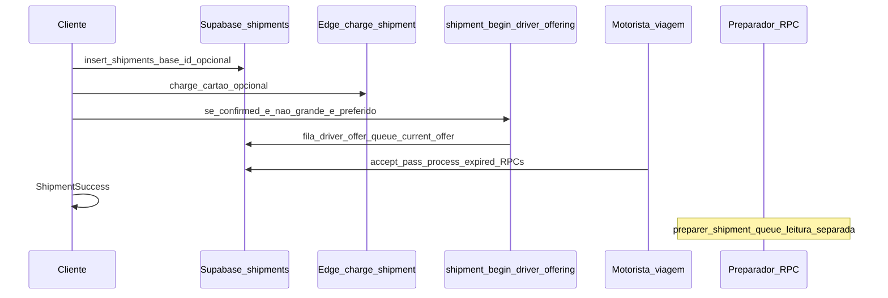

# Investigação: fluxo Envios e repasse ao motorista ideal

## Modelo operacional alvo (consolidado — input produto)

Dois papéis distintos:

1. **Motorista carro (Takeme ou Parceiro)**  
   - Cadastra **rota/agenda** (`scheduled_trips`: origem, destino, dias/horários).  
   - Cliente **compra assento** nessa viagem (fluxo `TripStack`: `PlanTrip` / `PlanRide` → `ConfirmDetails` → `Checkout` com `scheduled_trip_id` e passageiros; capacidade de **malas** no bagageiro via `bags_count` no checkout — é **bagagem de passageiro**, não o produto `shipments`).

2. **Preparador de encomenda (moto ou carro foco encomenda)**  
   - Objetivo único: **coletar na origem definida pelo cliente, levar até a base e confirmar entrega na base** (fim do papel do preparador na plataforma).  
   - **Pós-base**: o que a base faz com o produto até o destino final é **fora da plataforma** — **não existe** fluxo in-app para essa etapa (escopo produto confirmado).  
   - **Prioridade**: na **região que tem base**, o preparador deve ser **sempre a primeira opção** antes de repassar ao motorista Takeme/Parceiro na rota “normal”.  
   - **Sem base na cidade**: o motorista **Takeme ou Parceiro** pega na **casa do cliente** e entrega no **destino final**, **sem passar por base** — inclusive quando o envio vai **na mesma viagem** em que há outros passageiros (o trecho na plataforma é esse único leg origem→destino).

**Desalinhamento principal com o código atual** (detalhado nas seções seguintes):

- Não existe ramificação “**se `base_id` → não oferecer `shipment_begin_driver_offering` até preparador**”; a fila de viagem e o preparador **não** obedecem essa prioridade.  
- O matching de envio com `scheduled_trips` usa **origem e destino iguais ao envio do cliente** (porta a porta), não **origem + destino = base**.  
- `resolveShipmentBaseId` pode atribuir base mesmo fora da cidade (fallback), o que **não** corresponde a “cidade sem base”.  
- `preparer_shipment_queue` lista envios **com `driver_id` já preenchido** — **desalinhado** da regra alvo “**primeiro** o preparador coleta e leva à base” (na prática atual, a UI do preparador só entra depois de existir motorista de viagem atribuído).

---

## Viagem de passageiros + “encomenda” no mesmo carro

**Situação no código**

- **Reserva de passageiros**: fluxo em [`PlanTripScreen.tsx`](apps/cliente/src/screens/trip/PlanTripScreen.tsx) / [`CheckoutScreen.tsx`](apps/cliente/src/screens/trip/CheckoutScreen.tsx), tabela `bookings` (implícito pelo fluxo; detalhar em implementação futura).  
- **Envios (produto Envios)**: fluxo **separado** em `ShipmentStack`, mesmo conceito de “motorista” = linha de `scheduled_trips` com **mesma rota O/D** que o cliente digitou no envio ([`loadShipmentDriversForRoute.ts`](apps/cliente/src/lib/loadShipmentDriversForRoute.ts)), pagamento e `shipments.insert` em [`ConfirmShipmentScreen.tsx`](apps/cliente/src/screens/shipment/ConfirmShipmentScreen.tsx).

Ou seja: **tecnicamente** um cliente pode, em teoria, escolher a **mesma** `scheduled_trip_id` em dois fluxos diferentes (comprar assento no trip + escolher o mesmo motorista/viagem no envio), mas **não há um único checkout** “passageiro + encomenda”; não há FK visível no cliente entre `bookings` e `shipments`.

- Na tela de detalhe da viagem do cliente, a seção encomenda está **placeholder**: texto fixo “0 encomenda” / “Nenhuma encomenda” ([`TripDetailScreen.tsx`](apps/cliente/src/screens/trip/TripDetailScreen.tsx) ~444–505), **sem** consulta a `shipments`.

**Brechas**

- UX/ops: não dá para **ver** na viagem do passageiro se há pacote associado.  
- Capacidade: `bags_available` / `bags_count` da viagem **não** é decrementada ou validada contra `shipments` no fluxo Envios (risco de sobrecarga lógica se ambos existirem).  
- Produto: falta decisão se “encomenda na viagem” deve ser **um pedido** (booking com flag ou tabela de ligação) ou **dois pedidos** conscientemente vinculados.

---

## Visão geral do que o produto faz hoje

O fluxo de **Envios** no cliente segue a stack em [`apps/cliente/src/navigation/ShipmentStack.tsx`](apps/cliente/src/navigation/ShipmentStack.tsx): endereços → destinatário → **escolha de motorista (viagem agendada na mesma rota)** → confirmação/pagamento → sucesso (“Envio confirmado com sucesso!” em [`ShipmentSuccessScreen.tsx`](apps/cliente/src/screens/shipment/ShipmentSuccessScreen.tsx)).

Quem **“recebe”** o pedido no sentido de sistema:

- **Cliente**: confirma pagamento em [`ConfirmShipmentScreen.tsx`](apps/cliente/src/screens/shipment/ConfirmShipmentScreen.tsx) (`insert` em `shipments`, cobrança Stripe opcional via edge `charge-shipments`, depois navegação para sucesso).
- **Motorista de viagem agendada** (takeme/parceiro na prática via `scheduled_trips.badge` e ordem): **não** é broadcast para todos; é **oferta sequencial** (`current_offer_driver_id`) construída pela RPC `shipment_begin_driver_offering`.
- **Preparador de encomendas** (subtype `shipments`, com `base_id`): lista via RPC `preparer_shipment_queue` no app preparador ([`HomeEncomendasScreen.tsx`](apps/motorista/src/screens/encomendas/HomeEncomendasScreen.tsx)), **alinhada** à definição atual no banco (ver seção Gaps).



---

## 1) Seleção de endereço e “base / cidade”

- **Endereço**: [`SelectShipmentAddressScreen.tsx`](apps/cliente/src/screens/shipment/SelectShipmentAddressScreen.tsx) → `Recipient` com origem/destino/coords.
- **`base_id`**: resolvido no confirm com [`resolveShipmentBaseId`](apps/cliente/src/lib/resolveShipmentBase.ts):
  - Se **não existir nenhuma** base ativa em `bases`, retorna `null` (campo `base_id` **omitido** no insert).
  - Se existir **ao menos uma** base ativa, o algoritmo **sempre** escolhe uma: mais próxima da coleta, depois match de cidade no texto do endereço, e por fim **`rows[0]`** (primeira base da lista).

Ou seja: **“cidade sem base” no sentido de negócio não está modelada** como “não setar `base_id`” — só acontece `base_id` nulo se **não houver bases ativas no banco**. Se houver bases em outras cidades, o envio ainda pode receber `base_id` “equivocado” por fallback.

Trecho relevante do fallback:

```52:58:apps/cliente/src/lib/resolveShipmentBase.ts
  const addr = params.originAddress.toLowerCase();
  for (const b of rows) {
    const c = b.city?.trim().toLowerCase();
    if (c && addr.includes(c)) return b.id;
  }

  return rows[0]!.id;
```

---

## 2) Pagamento e disparo da “fila de motoristas”

Em [`ConfirmShipmentScreen.tsx`](apps/cliente/src/screens/shipment/ConfirmShipmentScreen.tsx):

1. `shipments.insert` com `status` `pending_review` (pacote grande) ou `confirmed` (demais fluxos tratados como confirmados no trecho analisado).
2. Cartão: `functions.invoke('charge-shipments', ...)`.
3. Se `status === 'confirmed'`, pacote **não** `grande` e existe **`clientPreferredDriverId`**: chama **`shipment_begin_driver_offering({ p_shipment_id })`**.
4. Em seguida, **sempre** `navigation.replace('ShipmentSuccess', ...)` salvo cancelamento/refund quando a RPC cancela por falta de rota.

**Gap importante**: se **não** houver `clientPreferredDriverId`, **a RPC não roda** (no servidor ela retorna `missing_preferred_driver`). O fluxo de UI ainda pode ir para sucesso — o envio fica sem fila iniciada por esse caminho.

---

## 3) Como o motorista “ideal” é escolhido (viagem / takeme vs parceiro)

### Lista no cliente (quem o usuário pode escolher)

[`loadShipmentDriversForRoute.ts`](apps/cliente/src/lib/loadShipmentDriversForRoute.ts) filtra `scheduled_trips` com **mesma rota por coordenadas** (origem + destino **iguais** às do envio do cliente). Ordenação: partida + prioridade de **`badge === 'Take Me'`** antes dos demais ([`clientScheduledTrips.ts`](apps/cliente/src/lib/clientScheduledTrips.ts) — mesma ideia replicada no SQL).

### Oferta no banco (quem vê a corrida)

Implementação em [`20260412140000_shipments_driver_offer_queue.sql`](supabase/migrations/20260412140000_shipments_driver_offer_queue.sql) (janela de tempo refinada em migrations posteriores, p.ex. [`20260415160000_shipment_driver_offer_window_30_minutes.sql`](supabase/migrations/20260415160000_shipment_driver_offer_window_30_minutes.sql)):

- Monta fila de `driver_id` distintos a partir de `scheduled_trips` com:
  - `status = 'active'`, `is_active`, `driver_journey_started_at` nulo, `departure_at > now()`, `seats_available > 0`
  - **`shipment_same_route_as_trip`**: igualdade **numérica estrita** de lat/lng origem e destino (tolerância ~1e-5 graus).
- Ordenação: `departure_at`, depois **`Take Me` primeiro**.
- Coloca **`client_preferred_driver_id` primeiro** na fila (mesmo que já estivesse na lista), depois os demais.
- **Não** há filtro explícito por `base_id`, `origin_city`, `driver_type` takeme/parceiro além do `badge` da viagem, nem ramificação “se tem base, não oferecer ao motorista de porta a porta”.

**Quem enxerga o envio na prática (motorista)**:

- Durante a oferta: só o motorista em **`current_offer_driver_id`** (política RLS `drivers_can_view_shipments` na mesma migration, com ajustes posteriores p.ex. [`20260415140000_shipments_driver_rls_see_offer_without_expiry_guard.sql`](supabase/migrations/20260415140000_shipments_driver_rls_see_offer_without_expiry_guard.sql)).
- **Não** é “aparece para todos os motoristas” — é **um de cada vez**, até passar/timeout/esgotar fila (funções `shipment_process_expired_driver_offers`, `shipment_driver_pass_offer`).

**Avanço da fila**: o subagente observou corretamente que **não** foi encontrado cron nas migrations para `shipment_process_expired_driver_offers`; o progresso depende de **clientes/motoristas** chamarem a RPC (ex.: tela de solicitações pendentes no motorista).

---

## 4) Preparador de encomendas vs motorista que entrega

### Definição atual de `preparer_shipment_queue` (pós `20260412140000`)

A função foi **alterada** para retornar envios em que **já existe `driver_id`** (motorista de **viagem agendada** aceitou o envio), com `base_id` preenchido e status operacional — comentário no SQL: preparador **após** esse motorista.

```33:44:supabase/migrations/20260412140000_shipments_driver_offer_queue.sql
  SELECT s.*
  FROM public.shipments s
  INNER JOIN public.worker_profiles wp
    ON wp.id = auth.uid()
   AND wp.subtype = 'shipments'
   AND wp.base_id IS NOT NULL
   AND wp.base_id = s.base_id
  WHERE s.driver_id IS NOT NULL
    AND s.base_id IS NOT NULL
    AND s.status IN ('pending_review', 'confirmed', 'in_progress')
```

**Narrativa alvo (confirmada pelo produto)**  
- Com base: preparador/motoboy/carro de carga **sempre** leva até a base e confirma na base; **não** há na plataforma um “segundo motorista” pós-base até o destino final — isso é **fora do produto**.  
- Sem base: motorista Takeme/Parceiro **origem → destino final**, sem base (pode ser viagem com passageiros).

**Desalinhamento com o código**  
A fila `preparer_shipment_queue` **só** lista pedidos **já com `driver_id`** (motorista de viagem). Isso **não** reflete “preparador **primeiro** na coleta até a base”; reflete um modelo em que o preparador aparece **depois** de haver motorista de carro atribuído ao `shipment`.

### RLS vs RPC (lacuna de consistência)

Na mesma migration, a política `drivers_can_view_shipments` inclui um ramo em que preparador (`worker_is_shipments_preparer_for_base`) pode ver envios **`driver_id IS NULL`** com `base_id` não nulo. Porém o app preparador usa **`rpc('preparer_shipment_queue')`**, que **exige** `driver_id IS NOT NULL`. Resultado: **a lista da UI do preparador não reflete necessariamente tudo que a RLS permitiria**.

---

## 5) Notificações e tempo real

- Há trigger em [`20260409200000_notifications_driver_booking_shipment.sql`](supabase/migrations/20260409200000_notifications_driver_booking_shipment.sql) para notificar motorista quando **`scheduled_trip_id`** é associado e **`base_id` IS NULL** (entre outras condições). **Não** cobre a fila `current_offer_driver_id`.
- O app motorista carrega notificações em foco de tela; **não** há evidência de canal Realtime dedicado para novas ofertas de envio (dependência de pull/RPC).

---

## 6) Gaps e riscos (resumo executivo)

| Tema | Situação no código |
|------|---------------------|
| **“Cidade sem base”** | `base_id` só fica ausente se **não houver bases ativas**; com bases em qualquer lugar, pode cair no **fallback da primeira base**. |
| **Preparador primeiro vs motorista direto** | Não há branch “se tem base → só preparador”; a oferta `shipment_begin_driver_offering` **não considera** `base_id`. |
| **Rota hub (cliente → base)** vs **rota final (cliente → destino)** | Matching exige **mesmas coords** que o envio do cliente. Viagens cadastradas como **origem → base** **não entram** na mesma rota de um envio **origem → destino final**. |
| **Broadcast** | **Não**: oferta **sequencial** por `current_offer_driver_id`. |
| **Take Me vs parceiro** | Priorização via **`scheduled_trips.badge`** (Take Me primeiro), não necessariamente `driver_type` do perfil. |
| **Sem motorista preferido** | RPC de oferta **não inicia** (`missing_preferred_driver`); risco de envio **confirmado sem fila**. |
| **Preparador / timing** | `preparer_shipment_queue` exige **`driver_id` preenchido** — na prática, **após** motorista de viagem; a regra alvo é preparador **antes** (só ele até a base), sem etapa pós-base na plataforma. |
| **RLS vs RPC preparador** | RLS pode expor cenários `driver_id` nulo com base; RPC do app **não**. |
| **Expiração de oferta** | Sem cron encontrado: avanço depende de chamadas à RPC de processamento. |
| **Prioridade “base → preparador primeiro”** | **Não implementada**: oferta a motorista de viagem **não** é bloqueada/suprimida quando há `base_id`; preparador não é etapa obrigatória antes da fila. |
| **Preparador = só até a base** | Modelo de dados do envio ainda é **O/D do cliente**; não há estado/rota explícita “leg1 até base” no fluxo self-service do cliente alinhada ao preparador. |
| **Encomenda + passageiros mesmo carro** | Dois fluxos **paralelos**; detalhe da viagem **não** lista `shipments` (placeholder). |

---

## 7) Arquivos centrais para auditoria futura (somente leitura)

- Cliente: [`ConfirmShipmentScreen.tsx`](apps/cliente/src/screens/shipment/ConfirmShipmentScreen.tsx), [`resolveShipmentBase.ts`](apps/cliente/src/lib/resolveShipmentBase.ts), [`loadShipmentDriversForRoute.ts`](apps/cliente/src/lib/loadShipmentDriversForRoute.ts), [`ShipmentStack.tsx`](apps/cliente/src/navigation/ShipmentStack.tsx)
- Supabase: [`20260412140000_shipments_driver_offer_queue.sql`](supabase/migrations/20260412140000_shipments_driver_offer_queue.sql) + migrations `202604151*` que redefinem as mesmas RPCs/RLS
- Motorista: tela de pendentes citada pelo subagente [`PendingRequestsScreen.tsx`](apps/motorista/src/screens/PendingRequestsScreen.tsx) (ofertas + vínculos `scheduled_trip_id`); preparador [`HomeEncomendasScreen.tsx`](apps/motorista/src/screens/encomendas/HomeEncomendasScreen.tsx)
- Admin (fluxo manual): [`queries.ts`](apps/admin/src/data/queries.ts) — `createShipmentTripViaBase` / `createShipmentTripDirect` cria viagem e associa `shipments.scheduled_trip_id` (caminho operacional paralelo ao self-service do cliente)

---

## Próximos passos sugeridos (fora do escopo deste documento)

1. **Congelar** a máquina de estados desejada: com base → preparador **primeiro** (origem→base, confirmação na base); pós-base **fora da plataforma**; sem base → Takeme/Parceiro origem→destino final (matching de rota, possivelmente mesma viagem que passageiros).  
2. **Definir** “cidade/região com base” (tabela `bases` por cidade, raio, feature flag) para substituir o fallback `rows[0]` em [`resolveShipmentBase.ts`](apps/cliente/src/lib/resolveShipmentBase.ts).  
3. **Ajustar** matching (`loadShipmentDriversForRoute`, `shipment_begin_driver_offering`, `shipment_same_route_as_trip`) para o trecho **origem → base** quando aplicável.  
4. **Unificar ou documentar** o caso “mesmo `scheduled_trip_id`”: booking vs shipment + UI em `TripDetailScreen`.  
5. Qualquer alteração no app **preparador de encomendas** / RPCs dedicadas: respeitar a regra do repositório de escopo (só com pedido explícito).

O plano acima já reflete o **modelo alvo** que você descreveu frente ao **comportamento atual** do repositório.
