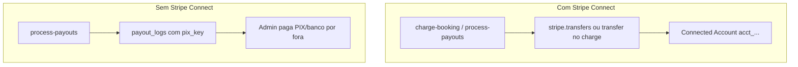

# Chave Pix no app vs repasse Stripe

## Duas trilhas no código

### 1. Com conta Connect (`stripe_connect_account_id` presente)

- Em cobrança de corrida, quando `stripe_connect_charges_enabled` é true, o repasse no charge usa o **ID da conta conectada**, não o `pix_key` do Take Me — ver [`supabase/functions/charge-booking/index.ts`](supabase/functions/charge-booking/index.ts) (select de `stripe_connect_account_id` + `transfer_data` / `application_fee_amount`).
- Em [`supabase/functions/process-payouts/index.ts`](supabase/functions/process-payouts/index.ts), para envios/curso com transfer explícito, o corpo da chamada Stripe usa apenas `destination` = `worker.stripe_connect_account_id` (linhas ~335–338). **Não há parâmetro de chave Pix do `worker_profiles` nessa chamada.**

Ou seja: do ponto de vista da API Stripe, o “caminho do dinheiro” é **plataforma → conta conectada (balance)** e, em seguida, **payout da Stripe** da conta conectada para o banco/PIX que o trabalhador **cadastrou na Stripe** (Express onboarding). Isso não é TED no sentido de “você cola uma chave Pix num transfer da API”; é o **rail de payouts da Stripe** na conta conectada (regulamentação e produto da Stripe no BR).

### 2. Sem Connect (ou fluxo manual)

- No mesmo arquivo [`process-payouts/index.ts`](supabase/functions/process-payouts/index.ts), quando **não** há Connect (`hasConnect` falso), os payouts vão para `processing` e o log inclui `pix_key: worker?.pix_key` para **export / operação manual** (“admin vai pagar externamente via PIX/banco”) — trecho ~418–444.

Aqui a chave Pix do app **faz sentido operacionalmente**: é referência para o time pagar manualmente, não integração automática Stripe→Pix usando esse campo.

## Resposta direta à sua dúvida

| Onde está a chave Pix | Função no Take Me hoje |
|----------------------|-------------------------|
| **No app** (`worker_profiles.pix_key`) | Principalmente **manual** + exibição; **não** é o destino da `transfers.create` Connect. |
| **No Stripe** (onboarding Connect) | Define **como a conta conectada recebe** o saldo (payouts Stripe; no Brasil via dados coletados no fluxo Stripe). |

Portanto: **não** espere que a Stripe use automaticamente a chave Pix do app como destino da `transfer` para a subconta. Para Connect ativo, o que “funciona na hora do Stripe” é a **conta conectada aprovada** + **dados de recebimento na Stripe**. A chave do app pode coincidir com o que a pessoa colocou na Stripe, mas são **dois cadastros**; só o da Stripe alimenta o payout automático da subconta.

## Opcional (produto / documentação)

- Ajustar texto na tela de Pagamentos (uma linha) esclarecendo: “Chave Pix para repasses manuais; com recebimento automático Stripe ativo, o destino é o cadastro na Stripe.” — evita expectativa errada. Não é obrigatório para o sistema funcionar.
