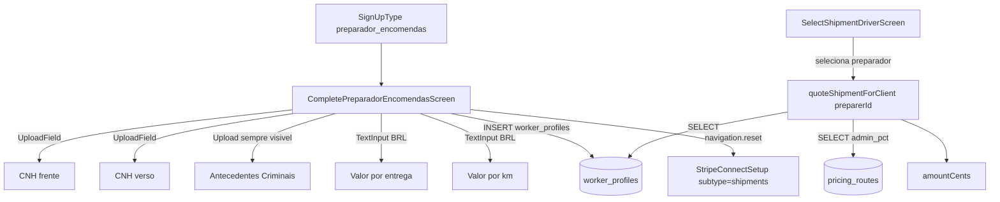

# Mudanças

## 1) Migration: nova coluna de tarifa por preparador de encomendas

Criar `supabase/migrations/20260424121000_worker_profiles_shipment_pricing.sql`:

```sql
ALTER TABLE public.worker_profiles
  ADD COLUMN IF NOT EXISTS shipment_delivery_fee_cents integer NULL
    CHECK (shipment_delivery_fee_cents IS NULL OR shipment_delivery_fee_cents >= 0),
  ADD COLUMN IF NOT EXISTS shipment_per_km_fee_cents integer NULL
    CHECK (shipment_per_km_fee_cents IS NULL OR shipment_per_km_fee_cents >= 0);

COMMENT ON COLUMN public.worker_profiles.shipment_delivery_fee_cents IS
  'Valor fixo cobrado por entrega quando o preparador é escolhido (centavos). NULL = usar catálogo pricing_routes.';
COMMENT ON COLUMN public.worker_profiles.shipment_per_km_fee_cents IS
  'Valor por km cobrado adicionalmente pelo preparador (centavos). NULL = usar catálogo pricing_routes.';
```

Nullable de propósito: preparadores já cadastrados continuam funcionando; o fallback para o catálogo `pricing_routes` é preservado. Não requer nova RLS (colunas cobertas pelas policies existentes).

Aplicar via MCP Supabase `apply_migration` no projeto remoto após commit (igual ao fluxo usado na migration de pricing de excursões).

## 2) Redesign de [apps/motorista/src/screens/CompletePreparadorEncomendasScreen.tsx](apps/motorista/src/screens/CompletePreparadorEncomendasScreen.tsx)

Reescrever a tela seguindo o Figma 340:14250 (mesmo design base usado para o preparador de excursões), mas com o subtítulo adaptado para encomendas e a seção de CNH replicando o padrão do motorista parceiro.

- **Header**: remover `OnboardingStepHeader`. Novo header: `SafeAreaView` + botão voltar circular à esquerda, título "Complete seu cadastro" centralizado.
- **Título grande** "Complete seu cadastro" + subtítulo "Preencha suas informações para que possamos validar seu perfil como preparador de encomendas."
- **Dados básicos** (fundo `#F1F1F1`, `borderRadius: 8`, `paddingVertical: 12`, sem borda, placeholder cinza, texto `#0D0D0D`): Nome completo, CPF, Idade, Cidade (via `GoogleCityAutocomplete` com as mesmas props de estilo usadas em excursões — ver ajuste do `input` com `borderWidth: 0`), Anos de experiência com encomendas.
- **Veículo de entrega** (mantido, opcional):
  - Radio "Possui veículo próprio?" (Sim/Não) — estilo novo do Figma.
  - Quando "Sim": Ano, Modelo, Placa, Telefone, Capacidade (volumes), upload do documento do veículo e fotos (≥2). Todos os campos aplicam o mesmo estilo F1F1F1.
  - Quando "Não": oculta o bloco inteiro; cadastro pode ser enviado sem esses campos.
- **Documentos** (CNH frente/verso — reaproveitando o padrão do motorista parceiro):
  - Extrair o subcomponente `UploadField` hoje definido em [apps/motorista/src/screens/CompleteDriverRegistrationScreen.tsx](apps/motorista/src/screens/CompleteDriverRegistrationScreen.tsx) (linhas ~557–575 + estilos `uploadWrap`, `uploadBox`, `uploadIconWrap`, `uploadTitle`, `uploadCaption`) para `apps/motorista/src/components/UploadField.tsx` para poder importar nas duas telas. Sem alterar a aparência visual atual do motorista.
  - Usar dois `UploadField`: "CNH (frente)" / "Upload da frente" e "CNH (verso)" / "Upload do verso"; mesma caption: "Aceitamos RG, CNH ou documento de identificação válido com foto."
  - Upload "Antecedentes Criminais" **sempre visível** (remover o checkbox "Apresentar Antecedentes Criminais" e lógica associada). Mostrar ícone de info clicável ao lado do título que abre via `Linking` o site da Polícia Federal. Caption: "O arquivo deve ter sido emitido nos últimos 90 dias."
- **Valores e precificação** (novo):
  - "Valor por entrega (R$)" — `TextInput` com máscara BRL via `formatCurrencyBRL` / `currencyInputToCents` já existente em [apps/motorista/src/utils/formatCurrency.ts](apps/motorista/src/utils/formatCurrency.ts).
  - "Valor por km (R$)" — idem.
  - Ambos obrigatórios para submeter.
- **Termos/notificações**: dois checkboxes — "Concordo com os Termos de Uso e a Política de Privacidade" (links) e "Aceito receber ofertas e comunicações do Take Me." (opcional). Mesmos estilos de checkbox do redesign de excursões.
- **Footer**: botão preto "Enviar cadastro" + botão secundário "Voltar para o login". Remover a dica de Stripe que existia antes (Stripe continua sendo cobrado depois, via navegação para `StripeConnectSetup` com `subtype: 'shipments'`).

**Payload em `worker_profiles`** (atualizar o trecho que começa em `CompletePreparadorEncomendasScreen.tsx` linhas ~191–204):

```typescript
const workerPayload = {
  role: 'preparer' as const,
  subtype: 'shipments' as const,
  status: nextStatus,
  cpf: cpfDigits,
  age: ageNum,
  city: city.trim(),
  experience_years: expNum,
  has_own_vehicle: ownsVehicle,
  cnh_document_url: cnhFrontPath,
  cnh_document_back_url: cnhBackPath,
  background_check_url: criminalPath,
  shipment_delivery_fee_cents: deliveryFeeCents,
  shipment_per_km_fee_cents: perKmFeeCents,
  base_id: baseId,
  updated_at: nowIso,
};
```

Observação: `cnh_document_back_url` já é coluna existente (adicionada anteriormente para excursões) — confirmar no schema durante a implementação; se não existir, acrescentar na mesma migration da seção 1.

## 3) Integrar tarifa do preparador no cálculo do cliente

[apps/cliente/src/lib/shipmentQuote.ts](apps/cliente/src/lib/shipmentQuote.ts) — adicionar parâmetro opcional `preparerId`:

```typescript
export async function quoteShipmentForClient(params: {
  /* …campos atuais… */
  preparerId?: string;
}): Promise<ShipmentQuoteResponse>
```

Fluxo quando `preparerId` for passado:

1. Continuar lendo `pricing_routes` como hoje para obter `admin_pct` e `pricingRouteId` do trecho mais adequado (snapshot `price_route_base_cents` é obrigatório e serve de referência). Se não houver catálogo, admin_pct = 0.
2. Ler `worker_profiles.shipment_delivery_fee_cents, shipment_per_km_fee_cents` para esse `preparerId`.
3. Se **pelo menos um** dos dois for `> 0`, calcular `baseBeforeSize = (delivery_fee_cents ?? 0) + billableKm * (per_km_fee_cents ?? 0)` em vez da `catalogBaseCentsAsync`. Aplicar `PACKAGE_SIZE_MULT` normalmente.
4. Se ambos forem NULL/0, manter o comportamento atual (catálogo).

`priceRouteBaseCents` retornado passa a ser a base efetiva (preparador ou catálogo).

## 4) Recalcular quote ao selecionar preparador

[apps/cliente/src/screens/shipment/SelectShipmentDriverScreen.tsx](apps/cliente/src/screens/shipment/SelectShipmentDriverScreen.tsx) — ao selecionar um item da lista de motoristas, chamar `quoteShipmentForClient(...)` passando `preparerId: sel.driver_id`. Guardar o quote selecionado em state separado (`selectedQuote`) e usar ele no `handleContinue` em vez do `quote` genérico.

- Enquanto nenhum motorista estiver selecionado, seguir mostrando o `quote` genérico (comportamento atual, preço base do catálogo) — evita piscar e não quebra a tela quando a lista está vazia.
- Indicador de loading pequeno ao trocar seleção.

O insert final em [apps/cliente/src/screens/shipment/ConfirmShipmentScreen.tsx](apps/cliente/src/screens/shipment/ConfirmShipmentScreen.tsx) (via `shipmentOrderInsertFromQuoteParams`) não precisa mudar porque já recebe `amountCents/pricingSubtotalCents/priceRouteBaseCents/...` via params.

## 5) Fluxo



# Pontos fora de escopo

- Tela `CompletePreparadorExcursoesScreen.tsx` — não tocar.
- Admin / `pricing_routes` — manter como fonte de `admin_pct` e fallback; não alterar UI admin.
- Edge functions de cobrança — não alterar.
- Coluna `worker_profiles.pix_key` — não remover.

# Pontos de atenção

- A regra `.cursor/rules/preparador-encomendas-nao-alterar.mdc` impede alterações no escopo preparador de encomendas sem pedido explícito; o usuário pediu explicitamente, ok avançar mas sem side-effects extras.
- `UploadField` hoje é definido inline em `CompleteDriverRegistrationScreen.tsx`; ao extrair para componente compartilhado, verificar se o código do motorista parceiro continua funcionando (import troca, nada mais).
- `quoteShipmentForClient` é chamado hoje ANTES de selecionar motorista; ao adicionar recálculo por preparador, garantir que a UI não trave (loading local, debounce opcional se estiver trocando seleção rapidamente).
- Aplicar a migration no remote via MCP Supabase (`apply_migration`) após a criação do arquivo — igual ao fluxo anterior com `20260424120000_worker_profiles_excursion_pricing.sql`.
- Rodar `ReadLints` em todos os arquivos alterados + novo componente.
- Sem mudanças em RPC/edge functions/policies.