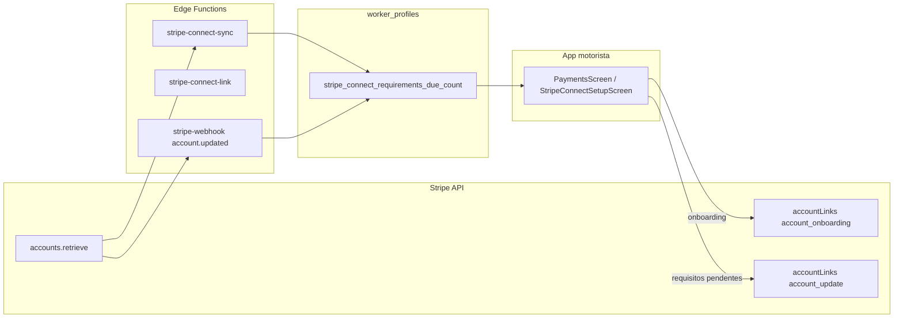

# Plano: exigências Stripe pendentes na UI do motorista

## O que está acontecendo (causa raiz)

1. **Semântica da Stripe vs. texto do dashboard**  
   A mensagem “Atualizar representante da empresa” no painel da Stripe é, no Connect, o rótulo de um **requisito de verificação da pessoa/representante da conta** — em contas de **pessoa física** (MEI / individual) costuma ser o **próprio titular**, não necessariamente “PJ”. O fluxo de onboarding pode não ter mostrado esse passo até a Stripe **reabrir** requisitos após uma checagem (AML/KYC, inconsistência de dados, etc.).

2. **Por que o app mostra só “Em análise”**  
   O estado vem de [`getStripeConnectState`](apps/motorista/src/lib/motoristaAccess.ts): conta existe, `charges_enabled === false`, `details_submitted === true` → **`in_review`**, sem olhar requisitos pendentes.

```26:30:apps/motorista/src/lib/motoristaAccess.ts
export function getStripeConnectState(row: StripeConnectRow | null | undefined): StripeConnectState {
  if (!row?.stripe_connect_account_id) return 'none';
  if (row.stripe_connect_charges_enabled === true) return 'active';
  if (row.stripe_connect_details_submitted === true) return 'in_review';
  return 'incomplete';
}
```

3. **Por que não há URL / botão no app**  
   - Na [`PaymentsScreen`](apps/motorista/src/screens/PaymentsScreen.tsx), o cartão **`in_review` é não clicável** (`clickable: false`), então o motorista não consegue reabrir o Stripe.  
   - A edge [`stripe-connect-link`](supabase/functions/stripe-connect-link/index.ts) só cria links com `type: "account_onboarding"`. Para contas que **já enviaram o onboarding** mas a Stripe **ainda exige dados**, o fluxo correto costuma ser **`account_update`** (equivalente ao “Solicitar dados” / link de remediação no dashboard).  
   - A [`stripe-connect-sync`](supabase/functions/stripe-connect-sync/index.ts) já calcula `requirementsDue` a partir de `currently_due` + `past_due`, mas **só devolve no JSON** e **não grava no banco**; a tela **ignora** essa resposta e relê só `worker_profiles` sem esse campo.

## Direção da solução



1. **Persistir contagem de requisitos** (nova coluna, por exemplo `stripe_connect_requirements_due_count integer not null default 0` em `worker_profiles`) e mantê-la atualizada em:
   - [`stripe-connect-sync`](supabase/functions/stripe-connect-sync/index.ts) (já há o cálculo; falta `update` no mesmo `update` que já grava `charges_enabled` / `details_submitted`).
   - [`handleAccountUpdated`](supabase/functions/stripe-webhook/index.ts) no webhook `account.updated` (mesma lógica: `currently_due.length + past_due.length`).

2. **Novo estado derivado no app** (ex.: `needs_stripe_update` ou `action_required`):  
   - Se `charges_enabled` → `active`.  
   - Senão, se `details_submitted && requirements_due_count > 0` → **estado com CTA** (não confundir com “só esperar”).  
   - Senão, se `details_submitted` → `in_review` (análise sem itens em `currently_due`/`past_due`).  
   - Senão → `incomplete`.  
   Atualizar [`StripeConnectRow`](apps/motorista/src/lib/motoristaAccess.ts), [`canUseAppWithStripeState`](apps/motorista/src/lib/motoristaAccess.ts) (liberar app como hoje em `in_review`, **incluindo** o novo estado), selects em [`PaymentsScreen`](apps/motorista/src/screens/PaymentsScreen.tsx) e [`StripeConnectSetupScreen`](apps/motorista/src/screens/StripeConnectSetupScreen.tsx).

3. **`stripe-connect-link`**: aceitar no body algo como `link_type: "onboarding" | "update"` (default `"onboarding"`).  
   - `onboarding` → `type: "account_onboarding"` (comportamento atual).  
   - `update` → `type: "account_update"` quando a conta já existe.  
   O app chama `update` quando o estado for “requisitos pendentes”; mantém `onboarding` para `none` / `incomplete`.

4. **UI**  
   - [`PaymentsScreen`](apps/motorista/src/screens/PaymentsScreen.tsx): texto claro (“A Stripe precisa que você envie ou corrija informações”) + cartão **clicável** que invoca `stripe-connect-link` com `link_type: "update"`.  
   - [`StripeConnectSetupScreen`](apps/motorista/src/screens/StripeConnectSetupScreen.tsx): hoje o ramo `in_review` é uma tela estática sem botão; adicionar ramo equivalente para o novo estado com **“Completar informações na Stripe”** (mesmo invoke com `account_update`), ou redirecionar para Pagamentos — alinhar com o fluxo de gate em [`App.tsx`](apps/motorista/App.tsx).

5. **Documentação interna** (opcional, só se quiserem): ajustar o trecho do estado em [`apps/motorista/PRD.md`](apps/motorista/PRD.md) para descrever o 5º estado e a distinção onboarding vs update.

## O que você pode fazer **agora** (workaround até o deploy)

- Usar o link de remediação que a Stripe mostra no dashboard (“Solicitar dados”) **uma vez** para concluir o que falta; depois que `charges_enabled` virar `true`, o app passará a mostrar ativo.  
- Isso não substitui o fix: sem mudança de código, qualquer novo “requisito pendente” volta a ficar invisível no app.

## Escopo fora deste plano (se quiserem depois)

- Expor no admin ([`MotoristaEditScreen`](apps/motorista/src/screens/MotoristaEditScreen.tsx) / [`StripeConnectCard`](apps/admin/src/components/StripeConnectCard.tsx)) a mesma contagem ou um badge “ação necessária” para suporte operar sem abrir a Stripe.
