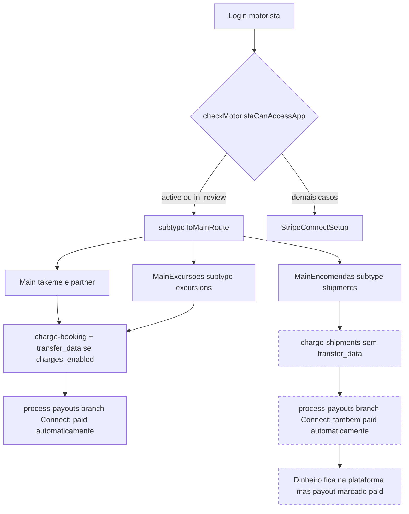

# Auditoria Stripe Connect por subtype — app Motorista

> Auditoria somente-leitura. Nenhum código, migration, secret ou dashboard foi alterado.
> Data: 2026-04-22. Escopo: 4 subtypes operacionais (`takeme`, `partner`, `shipments`, `excursions`).

## Resumo executivo

1. O **gate de acesso** Stripe Connect (`checkMotoristaCanAccessApp`) é aplicado **igualmente aos 4 subtypes** — não há bypass para preparadores. Todos são forçados a completar onboarding Connect para operar.
2. O **split automático via `transfer_data[destination]`** só existe para **viagens** (`charge-booking`). `charge-shipments` cobra o cliente direto na plataforma sem `transfer_data`. **Preparador de encomendas é forçado ao onboarding Connect, mas o dinheiro nunca transita pela conta Connect dele.**
3. O `process-payouts` trata "worker tem `stripe_connect_account_id`" como sinal de "já foi transferido no charge" e marca o payout `paid` — **premissa inválida para shipments** (risco de dinheiro "desaparecer" contabilmente sem ter sido de fato pago ao preparador).
4. Excursões como `excursion_requests` (orçamento) têm colunas Stripe (`stripe_payment_intent_id`, `worker_payout_cents`, `platform_fee_cents`) mas **nenhuma edge function cria PaymentIntent para esse tipo** — fluxo de cobrança de excursão-orçamento ainda não está implementado. Preparadores de excursão que operam `scheduled_trips` usam o mesmo `charge-booking` (split funciona).
5. A distribuição atual do banco mostra 2 preparadores de encomendas já aprovados (`status=approved`) **sem** conta Connect criada. Ainda não há payouts de shipment emitidos, então o bug do item 3 ainda não materializou — mas se materializará assim que o primeiro payout de shipment for gerado.

## Fluxo por subtype (diagrama)



## Parte A — Evidências no banco (executadas via MCP Supabase em 2026-04-22)

### A1. Distribuição por subtype x role x status

```sql
select subtype, role, status, count(*) as n
from public.worker_profiles
group by 1,2,3
order by 1,2,3;
```

| subtype | role | status | n |
|---|---|---|---|
| admin | admin | approved | 1 |
| excursions | preparer | inactive | 2 |
| partner | driver | approved | 1 |
| shipments | preparer | approved | 2 |
| shipments | preparer | inactive | 1 |
| takeme | driver | approved | 7 |

- 10 workers ativos (approved) operando: 1 admin, 1 partner, 2 shipments, 7 takeme, 0 excursions.
- Nenhum preparador de excursões em produção ainda. 2 preparadores de encomendas já liberados.

### A2. Estado Stripe Connect por subtype (entre workers `approved`)

```sql
select coalesce(subtype,'(null)') as subtype,
       case
         when stripe_connect_account_id is null then 'none'
         when coalesce(stripe_connect_charges_enabled,false) = true then 'active'
         when coalesce(stripe_connect_details_submitted,false) = true then 'in_review'
         else 'incomplete'
       end as stripe_state,
       count(*) as n
from public.worker_profiles
where status = 'approved'
group by 1,2
order by 1,2;
```

| subtype | stripe_state | n |
|---|---|---|
| admin | none | 1 |
| partner | none | 1 |
| shipments | none | 2 |
| takeme | none | 5 |
| takeme | incomplete | 1 |
| takeme | in_review | 1 |

- **Nenhum worker em produção hoje está com `stripe_connect_charges_enabled=true`.** Ou seja, nenhum split automático real aconteceu até agora; todas as cobranças de `charge-booking` vieram sem `transfer_data`.
- O usuário de teste `lucas.andrade@fraktalsoftwares.com.br` é o `takeme / in_review` (corresponde ao fluxo que o usuário acabou de testar).
- O único `partner` aprovado nem iniciou onboarding Connect.
- Os 2 preparadores de encomendas aprovados estão com `stripe_state=none` — ou seja, se o gate `canUseAppWithStripeState` está ativo, eles **não deveriam conseguir entrar no app** sem antes completar onboarding. Ver Parte D item 2.

### A3. Preparadores de encomendas aprovados (risco de dinheiro parado)

```sql
select id, subtype, role, status,
       stripe_connect_account_id,
       stripe_connect_charges_enabled,
       stripe_connect_details_submitted,
       stripe_connect_notified_approved_at
from public.worker_profiles
where subtype = 'shipments' and status = 'approved';
```

| id | stripe_connect_account_id | charges_enabled | details_submitted | notified_approved_at |
|---|---|---|---|---|
| `be425ce7-b7fa-4e40-97be-84bff79681d4` | null | false | false | null |
| `58b36f5b-f0f0-49be-ada7-cbfe085c9944` | null | false | false | null |

- Ambos em estado `none` (sem conta Connect criada).
- Pelo gate atual ([`motoristaAccess.ts` linhas 74-81](apps/motorista/src/lib/motoristaAccess.ts)), esses 2 usuários **caem em `needs_stripe_connect` no login** e são redirecionados para `StripeConnectSetup`. Precisam obrigatoriamente completar onboarding Stripe antes de operar encomendas.
- Porém, mesmo depois de aprovados pela Stripe, **o dinheiro das encomendas que eles entregarem não irá automaticamente para a conta Connect deles** (ver Parte D item 1).

### A4. Payouts existentes (query adaptada — não há coluna `log` em `payouts`)

```sql
select entity_type, status, payout_method, count(*) as n
from public.payouts
group by 1,2,3
order by 1,2,3;
```

| entity_type | status | payout_method | n |
|---|---|---|---|
| booking | paid | pix | 2 |
| booking | pending | pix | 9 |
| booking | processing | pix | 4 |

- **Todos os 15 payouts existentes são de `entity_type='booking'`. Nenhum de `shipment` ou `excursion_request` emitido ainda.**
- `payout_method='pix'` em 100% — não há payouts marcados como já pagos via Stripe Connect.
- O "bug" de `process-payouts` marcar payouts de shipment como `paid` automaticamente (ver Parte D item 1) **ainda não materializou em produção**, mas se materializará no momento em que:
  1. Um preparador de encomendas completar Connect (`stripe_connect_account_id` presente).
  2. O sistema emitir um payout com `entity_type='shipment'` para esse worker.

Evidência do código: [`process-payouts/index.ts` linhas 213-236](supabase/functions/process-payouts/index.ts) — ramo `if (hasConnect)` não verifica `entity_type` antes de marcar `paid`.

### A5. `excursion_requests` — não há PaymentIntent criado

```sql
select status, count(*) as total,
       sum(case when stripe_payment_intent_id is not null then 1 else 0 end) as com_stripe_pi
from public.excursion_requests
group by 1 order by 1;
```

Resultado: `[]` (tabela vazia).

- Nenhum `excursion_request` foi criado em produção.
- A tabela possui as colunas `stripe_payment_intent_id`, `driver_id`, `preparer_id`, `worker_payout_cents`, `platform_fee_cents`, `admin_pct_applied` (prontas para integrar Connect), mas **nenhuma edge function cria PaymentIntent** com referência a `excursion_request_id`:

```
Grep "transfer_data|stripe_connect" em supabase/functions/:
  charge-booking/index.ts       -- usa transfer_data (bookings)
  charge-shipments/index.ts     -- NAO usa (evidencia confirmada: zero matches)
  stripe-connect-link/index.ts  -- onboarding
  stripe-connect-sync/index.ts  -- sync de status
  stripe-webhook/index.ts       -- webhooks
  process-payouts/index.ts      -- payouts
  process-refund/index.ts       -- estornos
```

Ou seja, **o fluxo de cobrança de excursão-orçamento ainda não existe no código**. Preparadores de excursão que operam `scheduled_trips` (viagens agendadas tradicionais) passam por `charge-booking` e recebem split corretamente.

## Parte B — Checklist de código por subtype

### takeme e partner (role=`driver`, viagens)

- **Registro**: [`motoristaRegistration.ts`](apps/motorista/src/lib/motoristaRegistration.ts) linhas 173-191 (`mapDriverTypeToSubtypeDb` + insert em `worker_profiles`). Seta `role='driver'`, `subtype='takeme'|'partner'`, `status='inactive'`.
- **Roteamento pós-login**: [`motoristaAccess.ts` linha 109](apps/motorista/src/lib/motoristaAccess.ts) — `subtypeToMainRoute` cai no default `'Main'` (tabs de viagem).
- **Cobrança**: [`charge-booking/index.ts` linhas 316-353 e 536-540](supabase/functions/charge-booking/index.ts) — aplica `transfer_data[destination]` se `stripe_connect_charges_enabled=true`.
- **Payout**: `process-payouts` linha 214 — `hasConnect=true` → marca `paid` com `stripe_connect_transfer_at_charge`. **Coerente**, pois de fato a Stripe transferiu no momento do charge.

### excursions (role=`preparer`, subtype `excursions`)

- **Registro**: [`CompletePreparadorExcursoesScreen.tsx` linhas 185-204](apps/motorista/src/screens/CompletePreparadorExcursoesScreen.tsx). Seta `role='preparer'`, `subtype='excursions'`, `base_id`.
- **Roteamento**: [`motoristaAccess.ts` linha 110](apps/motorista/src/lib/motoristaAccess.ts) — `MainExcursoes`.
- **Cobrança (viagens agendadas)**: mesmo `charge-booking` usado por takeme/partner. Split funciona igual.
- **Cobrança (orçamentos `excursion_requests`)**: **não implementada** em edge function alguma. Ver A5.
- **Payout**: mesma regra de Connect do `process-payouts`. Enquanto a cobrança for via `charge-booking`, coerente.

### shipments (role=`preparer`, subtype `shipments`)

- **Registro**: [`CompletePreparadorEncomendasScreen.tsx` linhas 188-195](apps/motorista/src/screens/CompletePreparadorEncomendasScreen.tsx). Seta `role='preparer'`, `subtype='shipments'`, `base_id`.
- **Roteamento**: [`motoristaAccess.ts` linha 111](apps/motorista/src/lib/motoristaAccess.ts) — `MainEncomendas`.
- **Cobrança**: [`charge-shipments/index.ts`](supabase/functions/charge-shipments/index.ts) — **nenhuma referência a `transfer_data` ou `stripe_connect_account_id`**. Cobra cliente direto na plataforma.
- **Payout**: `process-payouts` linha 214 — aplica a mesma heurística "hasConnect → paid automaticamente", **mas sem nunca ter feito transferência real**. Dinheiro fica retido na plataforma; payout marcado `paid`.

## Parte C — Tabela de delta (4 subtypes × 5 dimensões)

| Dimensão | `takeme` | `partner` | `shipments` | `excursions` |
|---|---|---|---|---|
| **Gate Stripe Connect obrigatório** | sim (comum) | sim (comum) | sim (comum) | sim (comum) |
| **Cobrança com split Connect (`transfer_data`)** | sim (`charge-booking`) | sim (`charge-booking`) | **NÃO** (`charge-shipments` ignora Connect) | sim para `scheduled_trips`; **inexistente** para `excursion_requests` |
| **Payout coerente em `process-payouts`** | sim | sim | **NÃO** — marca paid sem ter transferido | sim para viagens; inexistente para orçamento |
| **Notificação de aprovação (push+email)** | sim (implementado hoje) | sim | sim | sim |
| **Status do PRD** | alinhado | alinhado | **desalinhado** (PRD fala `charges_enabled`, código libera `in_review`) | **parcial** (fluxo de orçamento sem edge function) |

Notas sobre a coluna "Notificação":
- Lógica está em [`stripe-webhook` e `stripe-connect-sync`](supabase/functions/stripe-webhook/index.ts) — independente de subtype. Dispara push (via `public.notifications` category `account_approved`) + e-mail (Resend) no momento em que `charges_enabled` vira `true`.
- Deep link do push hoje é fixo em `{ route: "Payments" }` — funciona para `takeme`/`partner` (estão sob `Main`). Para `shipments`/`excursions`, a rota `Payments` só existe dentro de `Main`, não dentro de `MainEncomendas`/`MainExcursoes`. Risco cosmético de deep link cair no lugar errado; UI principal ainda atualiza via `stripe-connect-sync`.

## Parte D — Lacunas priorizadas (sem corrigir)

### D1. ALTO — Preparador de encomendas nunca recebe split automático

- **Evidência de código**: [`charge-shipments/index.ts`](supabase/functions/charge-shipments/index.ts) (zero `transfer_data`, zero `stripe_connect`); [`process-payouts/index.ts` linhas 213-236](supabase/functions/process-payouts/index.ts) (marca `paid` assumindo transfer ocorreu).
- **Evidência de banco**: A4 confirma 0 payouts de shipment hoje → bug latente, não materializado. A3 mostra 2 preparadores aprovados que, se começarem a operar, vão acionar o bug.
- **Risco**: preparador de encomendas completa todo o onboarding Connect (obrigatório pelo gate), começa a operar, gera payouts — e esses payouts são marcados `paid` automaticamente sem que nenhum centavo tenha de fato chegado na conta Connect dele.
- **Duas soluções arquiteturais possíveis** (decisão do produto):
  - Adicionar `transfer_data[destination]` em `charge-shipments` (split no ato, igual viagens).
  - Manter cobrança centralizada + `stripe.transfers.create` explícito em `process-payouts` para `entity_type='shipment'`.

### D2. MÉDIO — PRD do motorista desatualizado

- **Evidência**: [`apps/motorista/PRD.md`](apps/motorista/PRD.md) descreve liberação do app apenas com `stripe_connect_charges_enabled=true`. Código em [`motoristaAccess.ts` linhas 74-81](apps/motorista/src/lib/motoristaAccess.ts) já libera em `in_review` também.
- **Impacto**: docs e código divergentes — operação/suporte pode interpretar errado o comportamento esperado.

### D3. MÉDIO — `excursion_requests` sem edge function de cobrança

- **Evidência**: Grep em `supabase/functions/` por `excursion_request` retorna apenas `process-refund`, `request-data-export` e `manage-excursion-budget` — nenhum deles cria PaymentIntent. A5 mostra tabela vazia em produção.
- **Impacto**: se o fluxo de orçamento de excursão for ativado, hoje não há código para cobrar o cliente. Subtype `excursions` que opera `scheduled_trips` funciona via `charge-booking`, mas a parte "orçamento por destino" não tem cobrança implementada.

### D4. BAIXO — Deep link de notificação Stripe sempre aponta para `Payments`

- **Evidência**: [`stripe-webhook/index.ts` linha 166](supabase/functions/stripe-webhook/index.ts) e [`stripe-connect-sync/index.ts` linha 167](supabase/functions/stripe-connect-sync/index.ts) — payload `{ route: "Payments" }` fixo.
- **Impacto**: motorista `shipments` ou `excursions` toca o push e o navegador tenta abrir `Payments` (rota de `Main`), não `PagamentosEncomendasScreen` ou `PagamentosExcursoesScreen`. Pequeno risco de UX quebrada — a UI principal atualiza mesmo assim via sync.

### D5. BAIXO — Ausência de alerta de "dinheiro preso" para admin

- Não há job/alerta para avisar admin quando um preparador de encomendas acumula valor que não foi repassado (consequência direta de D1). Seria mitigação importante enquanto D1 não for corrigido.

## Parte E — Próximas decisões (documentadas, não executadas)

1. **Split em encomendas**: adotar `transfer_data` em `charge-shipments` (split no ato) ou manter cobrança centralizada e fazer `stripe.transfers.create` no `process-payouts`? Impacta refunds (`process-refund`) e reconciliação contábil de forma diferente.
2. **Gate Stripe por subtype**: faz sentido manter preparador de encomendas bloqueado até completar onboarding Stripe, já que hoje o dinheiro nem transita pela conta Connect dele? Ou o gate deve ser relaxado para `shipments` (ex.: aceitar apenas PIX cadastrado) até D1 ser corrigido?
3. **Notificação de aprovação**: texto do push/email deve variar por subtype? Deep link deve ser parametrizado por subtype (ver D4)?
4. **Excursão-orçamento (`excursion_requests`)**: qual edge function vai cobrar? É um PaymentIntent único no fim da jornada? Usa `transfer_data` também?
5. **`in_review` vs `charges_enabled=true` obrigatório**: o PRD precisa ser atualizado para refletir o código atual, ou o código precisa voltar a exigir `charges_enabled=true` antes de liberar?
6. **Reconciliação dos 2 preparadores de encomendas já aprovados**: ambos estão sem conta Connect. Se entrarem no app hoje, são redirecionados para `StripeConnectSetup`. Eles foram informados desse passo? Precisa comunicação proativa?

---

## Referências rápidas

- Lógica de gate: [`apps/motorista/src/lib/motoristaAccess.ts`](apps/motorista/src/lib/motoristaAccess.ts)
- Registro de subtype: [`apps/motorista/src/lib/motoristaRegistration.ts`](apps/motorista/src/lib/motoristaRegistration.ts)
- Cobrança de viagem: [`supabase/functions/charge-booking/index.ts`](supabase/functions/charge-booking/index.ts)
- Cobrança de encomenda: [`supabase/functions/charge-shipments/index.ts`](supabase/functions/charge-shipments/index.ts)
- Payouts: [`supabase/functions/process-payouts/index.ts`](supabase/functions/process-payouts/index.ts)
- Notificação de aprovação Stripe: [`supabase/functions/stripe-webhook/index.ts`](supabase/functions/stripe-webhook/index.ts) + [`supabase/functions/stripe-connect-sync/index.ts`](supabase/functions/stripe-connect-sync/index.ts)
- PRD do motorista: [`apps/motorista/PRD.md`](apps/motorista/PRD.md)
